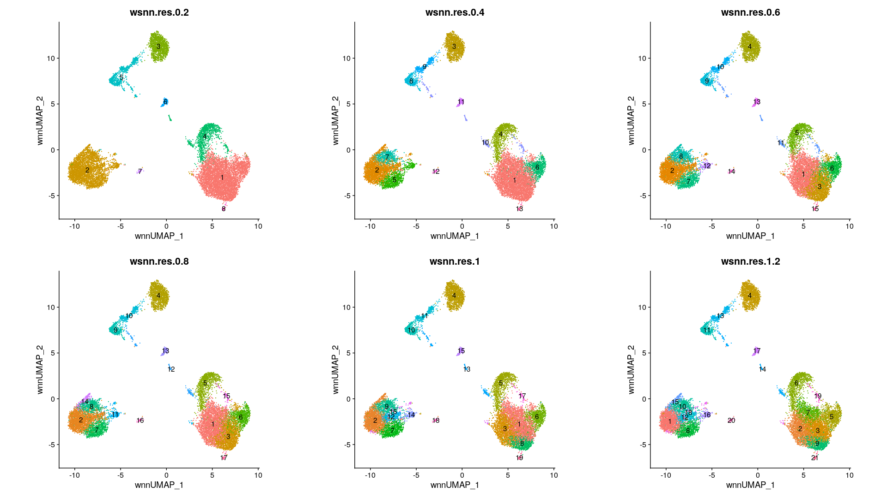
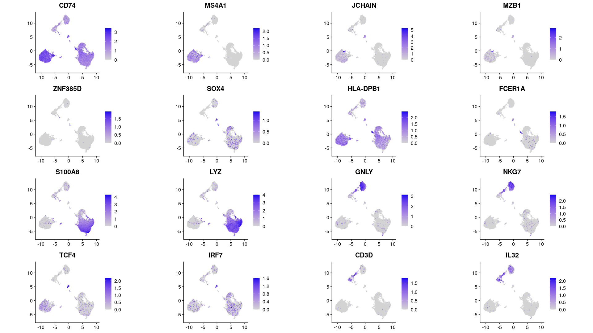
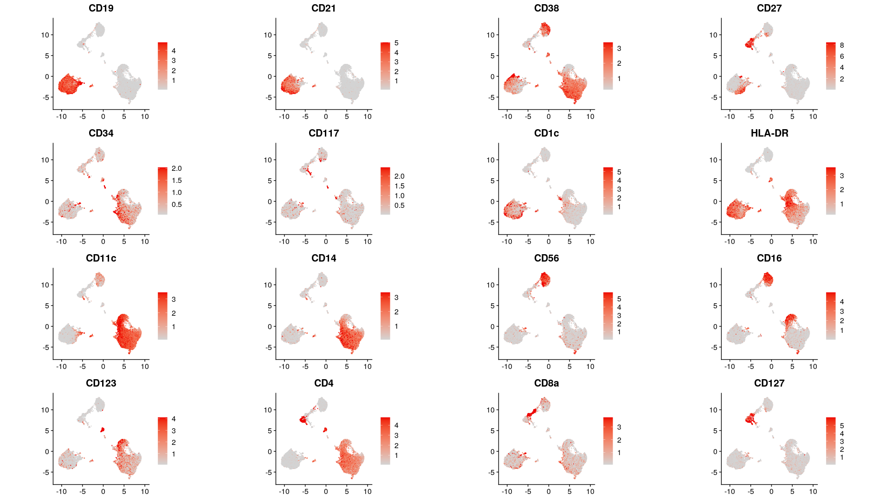

Analysis 05: Plotting demonstration
================
Kevin Thomas
20 January, 2022

-   [Plotting of initial analysis](#plotting-of-initial-analysis)
    -   [All resolutions](#all-resolutions)
    -   [Top 5 Gene markers at each
        resolution](#top-5-gene-markers-at-each-resolution)
    -   [Top 5 CITE markers at each
        resolution](#top-5-cite-markers-at-each-resolution)
-   [Gene markers of major cell
    types](#gene-markers-of-major-cell-types)
-   [CITE markers of major cell
    types](#cite-markers-of-major-cell-types)

## Plotting of initial analysis

``` r
wnn_clust_obj <- readRDS(file = here("demo_data", "wnn_clust_obj.RDS"))
```

### All resolutions

``` r
# Plot
map(
  .x = names(select(wnn_clust_obj@meta.data, starts_with(match = "wsnn."))),
  .f = function(x) {
    DimPlot(object = wnn_clust_obj, reduction = "umap_wnn", group.by = x, label = TRUE) +
      NoLegend() +
      labs(title = x) +
      coord_fixed()
  }
) %>% plot_grid(plotlist = ., ncol = 3)
```

<!-- -->

### Top 5 Gene markers at each resolution

``` r
map(
  .x = names(select(wnn_clust_obj@meta.data, starts_with(match = "wsnn."))),
  .f = function(x) {
    # x <- names(select(wnn_clust_obj@meta.data, starts_with(match = "wsnn.")))[1]
    top5_gene <- wilcoxauc(
      X = wnn_clust_obj,
      seurat_assay = "SCT",
      group_by = x
    ) |>
      as_tibble() |>
      select(
        feature,
        cluster = group,
        p_val = pval,
        p_val_adj = padj,
        avg_logFC = logFC,
        pct.1 = pct_in,
        pct.2 = pct_out,
        auc
      ) |>
      filter(p_val_adj < 0.05) |>
      mutate(cluster = factor(cluster, levels = levels(wnn_clust_obj@meta.data[, x]))) %>%
      split.data.frame(use_series(., cluster)) |>
      map(filter, avg_logFC > 0, pct.2 < 0.5) |>
      map(arrange, cluster, desc(auc), p_val_adj) |>
      map(top_n, 5, auc) |>
      map(select, feature) |>
      map(deframe) |>
      map(paste, collapse = "\n")

    DimPlot(object = wnn_clust_obj, reduction = "umap_wnn", group.by = x) +
      geom_label_repel(
        data = DimPlot(wnn_clust_obj, reduction = "umap_wnn", group.by = x)[[1]]$data |>
          group_by_at(x) |>
          summarize_all(median),
        aes(wnnUMAP_1, wnnUMAP_2, label = paste0(get(x), "\n", top5_gene), fill = get(x))
      ) +
      NoLegend() +
      labs(title = x) +
      coord_fixed()
  }
) %>% plot_grid(plotlist = ., ncol = 3)
```

    ## Warning: ggrepel: 1 unlabeled data points (too many overlaps). Consider increasing max.overlaps

<!-- -->

### Top 5 CITE markers at each resolution

``` r
map(
  .x = names(select(wnn_clust_obj@meta.data, starts_with(match = "wsnn."))),
  .f = function(x) {
    # x <- names(select(wnn_clust_obj@meta.data, starts_with(match = "wsnn.")))[1]
    top5_gene <- wilcoxauc(
      X = wnn_clust_obj,
      seurat_assay = "CITE",
      group_by = x
    ) |>
      as_tibble() |>
      select(
        feature,
        cluster = group,
        p_val = pval,
        p_val_adj = padj,
        avg_logFC = logFC,
        pct.1 = pct_in,
        pct.2 = pct_out,
        auc
      ) |>
      filter(p_val_adj < 0.05) |>
      mutate(cluster = factor(cluster, levels = levels(wnn_clust_obj@meta.data[, x]))) %>%
      split.data.frame(use_series(., cluster)) %>%
      map(filter, avg_logFC > 0) |>
      map(arrange, cluster, desc(avg_logFC), p_val_adj) |>
      map(top_n, 5, avg_logFC) |>
      # map(top_n, 5, auc) |>
      map(select, feature) |>
      map(deframe) |>
      map(paste, collapse = "\n")

    DimPlot(object = wnn_clust_obj, reduction = "umap_wnn", group.by = x) +
      geom_label_repel(
        data = DimPlot(wnn_clust_obj, reduction = "umap_wnn", group.by = x)[[1]]$data |>
          group_by_at(x) |>
          summarize_all(median),
        aes(wnnUMAP_1, wnnUMAP_2, label = paste0(get(x), "\n", top5_gene), fill = get(x))
      ) +
      NoLegend() +
      labs(title = x) +
      coord_fixed()
  }
) %>% plot_grid(plotlist = ., ncol = 3)
```

<!-- -->

## Gene markers of major cell types

``` r
FeaturePlot(
  `DefaultAssay<-`(object = wnn_clust_obj, value = "SCT"),
  features = c(
    "CD74", "MS4A1", "JCHAIN", "MZB1", "ZNF385D", "SOX4", "HLA-DPB1",
    "FCER1A", "S100A8", "LYZ", "GNLY", "NKG7", "TCF4", "IRF7", "CD3D", "IL32"
  ),
  reduction = "umap_wnn",
  coord.fixed = T,
  cols = c("lightgrey", "blue2"),
  order = T,
  combine = FALSE
) |>
  map(add, labs(x = NULL, y = NULL)) %>%
  plot_grid(plotlist = ., align = "hv")
```

<!-- -->

## CITE markers of major cell types

``` r
FeaturePlot(
  `DefaultAssay<-`(object = wnn_clust_obj, value = "CITE"),
  features = c(
    "CD19", "CD21", "CD38", "CD27", "CD34", "CD117", "CD1c", "HLA-DR", "CD11c",
    "CD14", "CD56", "CD16", "CD123", "CD4", "CD8a", "CD127"
  ),
  reduction = "umap_wnn",
  coord.fixed = T,
  cols = c("lightgrey", "red2"),
  min.cutoff = "q05",
  max.cutoff = "q95",
  combine = FALSE
) |>
  map(add, labs(x = NULL, y = NULL)) %>%
  plot_grid(plotlist = ., align = "hv")
```

<!-- -->

``` r
session_info()
```

    ## ─ Session info ───────────────────────────────────────────────────────────────────────────────────────────────────────────────────────────────────────────────────────────────────────────────────────────────────────────────────────────────────────────────────────────────────────────────────────────────────────────────────────────────────────────────────────────────────────────────────────────────────────────────────────────────────────────────────────────────────────────────────────────────────────────────────────────────────────────────────────────────────────────────────────────────────────────────────────────────────────────────────────────────────────────────────────────────────────────────────────────────────────────────────────────────────────────────────────────────────────────────────────────────────────────────────────────────────────────────────────────────────────────────────────────────────────────────────────────────────────────────────────────────────────────────────────────────────────────────────────────────────────────────────────────────────────────────────────────────────────────────────────────────────────────────────────────────────────────────────────────────
    ##  setting  value
    ##  version  R version 4.1.2 (2021-11-01)
    ##  os       Ubuntu 20.04.3 LTS
    ##  system   x86_64, linux-gnu
    ##  ui       X11
    ##  language (EN)
    ##  collate  en_US.UTF-8
    ##  ctype    en_US.UTF-8
    ##  tz       Etc/UTC
    ##  date     2022-01-20
    ##  pandoc   2.14.0.3 @ /usr/lib/rstudio-server/bin/pandoc/ (via rmarkdown)
    ## 
    ## ─ Packages ───────────────────────────────────────────────────────────────────────────────────────────────────────────────────────────────────────────────────────────────────────────────────────────────────────────────────────────────────────────────────────────────────────────────────────────────────────────────────────────────────────────────────────────────────────────────────────────────────────────────────────────────────────────────────────────────────────────────────────────────────────────────────────────────────────────────────────────────────────────────────────────────────────────────────────────────────────────────────────────────────────────────────────────────────────────────────────────────────────────────────────────────────────────────────────────────────────────────────────────────────────────────────────────────────────────────────────────────────────────────────────────────────────────────────────────────────────────────────────────────────────────────────────────────────────────────────────────────────────────────────────────────────────────────────────────────────────────────────────────────────────────────────────────────────────────────────────────────────
    ##  package         * version date (UTC) lib source
    ##  abind             1.4-5   2016-07-21 [1] RSPM (R 4.1.0)
    ##  BiocGenerics      0.40.0  2021-10-26 [1] Bioconductor
    ##  BiocManager     * 1.30.16 2021-06-15 [1] RSPM (R 4.1.0)
    ##  BiocNeighbors   * 1.12.0  2021-10-26 [1] Bioconductor
    ##  BiocParallel    * 1.28.3  2021-12-09 [1] Bioconductor
    ##  cachem            1.0.6   2021-08-19 [1] RSPM (R 4.1.0)
    ##  callr             3.7.0   2021-04-20 [1] RSPM (R 4.1.0)
    ##  cli               3.1.0   2021-10-27 [1] RSPM (R 4.1.0)
    ##  cluster           2.1.2   2021-04-17 [2] CRAN (R 4.1.2)
    ##  codetools         0.2-18  2020-11-04 [2] CRAN (R 4.1.2)
    ##  colorspace        2.0-2   2021-06-24 [1] RSPM (R 4.1.0)
    ##  cowplot         * 1.1.1   2020-12-30 [1] RSPM (R 4.1.0)
    ##  crayon            1.4.2   2021-10-29 [1] RSPM (R 4.1.0)
    ##  data.table      * 1.14.2  2021-09-27 [1] RSPM (R 4.1.0)
    ##  deldir            1.0-6   2021-10-23 [1] RSPM (R 4.1.0)
    ##  desc              1.4.0   2021-09-28 [1] RSPM (R 4.1.0)
    ##  devtools        * 2.4.3   2021-11-30 [1] RSPM (R 4.1.0)
    ##  digest            0.6.29  2021-12-01 [1] RSPM (R 4.1.0)
    ##  dplyr           * 1.0.7   2021-06-18 [1] RSPM (R 4.1.0)
    ##  ellipsis          0.3.2   2021-04-29 [1] RSPM (R 4.1.0)
    ##  evaluate          0.14    2019-05-28 [1] RSPM (R 4.1.0)
    ##  fansi             1.0.2   2022-01-14 [1] RSPM (R 4.1.0)
    ##  farver            2.1.0   2021-02-28 [1] RSPM (R 4.1.0)
    ##  fastmap           1.1.0   2021-01-25 [1] RSPM (R 4.1.0)
    ##  fitdistrplus      1.1-6   2021-09-28 [1] RSPM (R 4.1.0)
    ##  fs                1.5.2   2021-12-08 [1] RSPM (R 4.1.0)
    ##  future          * 1.23.0  2021-10-31 [1] RSPM (R 4.1.0)
    ##  future.apply      1.8.1   2021-08-10 [1] RSPM (R 4.1.0)
    ##  generics          0.1.1   2021-10-25 [1] RSPM (R 4.1.0)
    ##  ggplot2         * 3.3.5   2021-06-25 [1] RSPM (R 4.1.0)
    ##  ggrepel         * 0.9.1   2021-01-15 [1] RSPM (R 4.1.0)
    ##  ggridges          0.5.3   2021-01-08 [1] RSPM (R 4.1.0)
    ##  globals           0.14.0  2020-11-22 [1] RSPM (R 4.1.0)
    ##  glue              1.6.0   2021-12-17 [1] RSPM (R 4.1.0)
    ##  goftest           1.2-3   2021-10-07 [1] RSPM (R 4.1.0)
    ##  gridExtra         2.3     2017-09-09 [1] RSPM (R 4.1.0)
    ##  gtable            0.3.0   2019-03-25 [1] RSPM (R 4.1.0)
    ##  here            * 1.0.1   2020-12-13 [1] RSPM (R 4.1.0)
    ##  highr             0.9     2021-04-16 [1] RSPM (R 4.1.0)
    ##  htmltools         0.5.2   2021-08-25 [1] RSPM (R 4.1.0)
    ##  htmlwidgets       1.5.4   2021-09-08 [1] RSPM (R 4.1.0)
    ##  httpuv            1.6.5   2022-01-05 [1] RSPM (R 4.1.0)
    ##  httr              1.4.2   2020-07-20 [1] RSPM (R 4.1.0)
    ##  ica               1.0-2   2018-05-24 [1] RSPM (R 4.1.0)
    ##  igraph            1.2.11  2022-01-04 [1] RSPM (R 4.1.0)
    ##  irlba             2.3.5   2021-12-06 [1] RSPM (R 4.1.0)
    ##  jsonlite          1.7.3   2022-01-17 [1] RSPM (R 4.1.0)
    ##  KernSmooth        2.23-20 2021-05-03 [2] CRAN (R 4.1.2)
    ##  knitr             1.37    2021-12-16 [1] RSPM (R 4.1.0)
    ##  labeling          0.4.2   2020-10-20 [1] RSPM (R 4.1.0)
    ##  later             1.3.0   2021-08-18 [1] RSPM (R 4.1.0)
    ##  lattice           0.20-45 2021-09-22 [2] CRAN (R 4.1.2)
    ##  lazyeval          0.2.2   2019-03-15 [1] RSPM (R 4.1.0)
    ##  leiden            0.3.9   2021-07-27 [1] RSPM (R 4.1.0)
    ##  lifecycle         1.0.1   2021-09-24 [1] RSPM (R 4.1.0)
    ##  listenv           0.8.0   2019-12-05 [1] RSPM (R 4.1.0)
    ##  lmtest            0.9-39  2021-11-07 [1] RSPM (R 4.1.0)
    ##  magrittr        * 2.0.1   2020-11-17 [1] RSPM (R 4.1.0)
    ##  MASS              7.3-54  2021-05-03 [2] CRAN (R 4.1.2)
    ##  Matrix            1.3-4   2021-06-01 [2] CRAN (R 4.1.2)
    ##  matrixStats       0.61.0  2021-09-17 [1] RSPM (R 4.1.0)
    ##  memoise           2.0.1   2021-11-26 [1] RSPM (R 4.1.0)
    ##  mgcv              1.8-38  2021-10-06 [2] CRAN (R 4.1.2)
    ##  mime              0.12    2021-09-28 [1] RSPM (R 4.1.0)
    ##  miniUI            0.1.1.1 2018-05-18 [1] RSPM (R 4.1.0)
    ##  munsell           0.5.0   2018-06-12 [1] RSPM (R 4.1.0)
    ##  nlme              3.1-153 2021-09-07 [2] CRAN (R 4.1.2)
    ##  parallelly        1.30.0  2021-12-17 [1] RSPM (R 4.1.0)
    ##  patchwork         1.1.1   2020-12-17 [1] RSPM (R 4.1.0)
    ##  pbapply           1.5-0   2021-09-16 [1] RSPM (R 4.1.0)
    ##  pillar            1.6.4   2021-10-18 [1] RSPM (R 4.1.0)
    ##  pkgbuild          1.3.1   2021-12-20 [1] RSPM (R 4.1.0)
    ##  pkgconfig         2.0.3   2019-09-22 [1] RSPM (R 4.1.0)
    ##  pkgload           1.2.4   2021-11-30 [1] RSPM (R 4.1.0)
    ##  plotly            4.10.0  2021-10-09 [1] RSPM (R 4.1.0)
    ##  plyr              1.8.6   2020-03-03 [1] RSPM (R 4.1.0)
    ##  png               0.1-7   2013-12-03 [1] RSPM (R 4.1.0)
    ##  polyclip          1.10-0  2019-03-14 [1] RSPM (R 4.1.0)
    ##  presto          * 1.0.0   2022-01-20 [1] Github (immunogenomics/presto@052085d)
    ##  prettyunits       1.1.1   2020-01-24 [1] RSPM (R 4.1.0)
    ##  processx          3.5.2   2021-04-30 [1] RSPM (R 4.1.0)
    ##  promises          1.2.0.1 2021-02-11 [1] RSPM (R 4.1.0)
    ##  ps                1.6.0   2021-02-28 [1] RSPM (R 4.1.0)
    ##  purrr           * 0.3.4   2020-04-17 [1] RSPM (R 4.1.0)
    ##  R6                2.5.1   2021-08-19 [1] RSPM (R 4.1.0)
    ##  RANN              2.6.1   2019-01-08 [1] RSPM (R 4.1.0)
    ##  RColorBrewer      1.1-2   2014-12-07 [1] RSPM (R 4.1.0)
    ##  Rcpp            * 1.0.8   2022-01-13 [1] RSPM (R 4.1.0)
    ##  RcppAnnoy         0.0.19  2021-07-30 [1] RSPM (R 4.1.0)
    ##  remotes           2.4.2   2021-11-30 [1] RSPM (R 4.1.0)
    ##  reshape2          1.4.4   2020-04-09 [1] RSPM (R 4.1.0)
    ##  reticulate        1.23    2022-01-14 [1] RSPM (R 4.1.0)
    ##  rlang             0.4.12  2021-10-18 [1] RSPM (R 4.1.0)
    ##  rmarkdown         2.11    2021-09-14 [1] RSPM (R 4.1.0)
    ##  ROCR              1.0-11  2020-05-02 [1] RSPM (R 4.1.0)
    ##  rpart             4.1-15  2019-04-12 [2] CRAN (R 4.1.2)
    ##  rprojroot         2.0.2   2020-11-15 [1] RSPM (R 4.1.0)
    ##  rstudioapi        0.13    2020-11-12 [1] RSPM (R 4.1.0)
    ##  Rtsne             0.15    2018-11-10 [1] RSPM (R 4.1.0)
    ##  S4Vectors         0.32.3  2021-11-21 [1] Bioconductor
    ##  scales            1.1.1   2020-05-11 [1] RSPM (R 4.1.0)
    ##  scattermore       0.7     2020-11-24 [1] RSPM (R 4.1.0)
    ##  sctransform       0.3.3   2022-01-13 [1] RSPM (R 4.1.0)
    ##  sessioninfo       1.2.2   2021-12-06 [1] RSPM (R 4.1.0)
    ##  Seurat          * 4.1.0   2022-01-14 [1] RSPM (R 4.1.0)
    ##  SeuratObject    * 4.0.4   2021-11-23 [1] RSPM (R 4.1.0)
    ##  shiny             1.7.1   2021-10-02 [1] RSPM (R 4.1.0)
    ##  spatstat.core     2.3-2   2021-11-26 [1] RSPM (R 4.1.0)
    ##  spatstat.data     2.1-2   2021-12-17 [1] RSPM (R 4.1.0)
    ##  spatstat.geom     2.3-1   2021-12-10 [1] RSPM (R 4.1.0)
    ##  spatstat.sparse   2.1-0   2021-12-17 [1] RSPM (R 4.1.0)
    ##  spatstat.utils    2.3-0   2021-12-12 [1] RSPM (R 4.1.0)
    ##  stringi           1.7.6   2021-11-29 [1] RSPM (R 4.1.0)
    ##  stringr           1.4.0   2019-02-10 [1] RSPM (R 4.1.0)
    ##  survival          3.2-13  2021-08-24 [2] CRAN (R 4.1.2)
    ##  tensor            1.5     2012-05-05 [1] RSPM (R 4.1.0)
    ##  testthat          3.1.1   2021-12-03 [1] RSPM (R 4.1.0)
    ##  tibble          * 3.1.6   2021-11-07 [1] RSPM (R 4.1.0)
    ##  tidyr             1.1.4   2021-09-27 [1] RSPM (R 4.1.0)
    ##  tidyselect        1.1.1   2021-04-30 [1] RSPM (R 4.1.0)
    ##  usethis         * 2.1.5   2021-12-09 [1] RSPM (R 4.1.0)
    ##  utf8              1.2.2   2021-07-24 [1] RSPM (R 4.1.0)
    ##  uwot              0.1.11  2021-12-02 [1] RSPM (R 4.1.0)
    ##  vctrs             0.3.8   2021-04-29 [1] RSPM (R 4.1.0)
    ##  viridisLite       0.4.0   2021-04-13 [1] RSPM (R 4.1.0)
    ##  withr             2.4.3   2021-11-30 [1] RSPM (R 4.1.0)
    ##  xfun              0.29    2021-12-14 [1] RSPM (R 4.1.0)
    ##  xtable            1.8-4   2019-04-21 [1] RSPM (R 4.1.0)
    ##  yaml              2.2.1   2020-02-01 [1] RSPM (R 4.1.0)
    ##  zoo               1.8-9   2021-03-09 [1] RSPM (R 4.1.0)
    ## 
    ##  [1] /usr/local/lib/R/site-library
    ##  [2] /usr/local/lib/R/library
    ## 
    ## ──────────────────────────────────────────────────────────────────────────────────────────────────────────────────────────────────────────────────────────────────────────────────────────────────────────────────────────────────────────────────────────────────────────────────────────────────────────────────────────────────────────────────────────────────────────────────────────────────────────────────────────────────────────────────────────────────────────────────────────────────────────────────────────────────────────────────────────────────────────────────────────────────────────────────────────────────────────────────────────────────────────────────────────────────────────────────────────────────────────────────────────────────────────────────────────────────────────────────────────────────────────────────────────────────────────────────────────────────────────────────────────────────────────────────────────────────────────────────────────────────────────────────────────────────────────────────────────────────────────────────────────────────────────────────────────────────────────────────────────────────────────────────────────────────────────────────────────────────────────────
