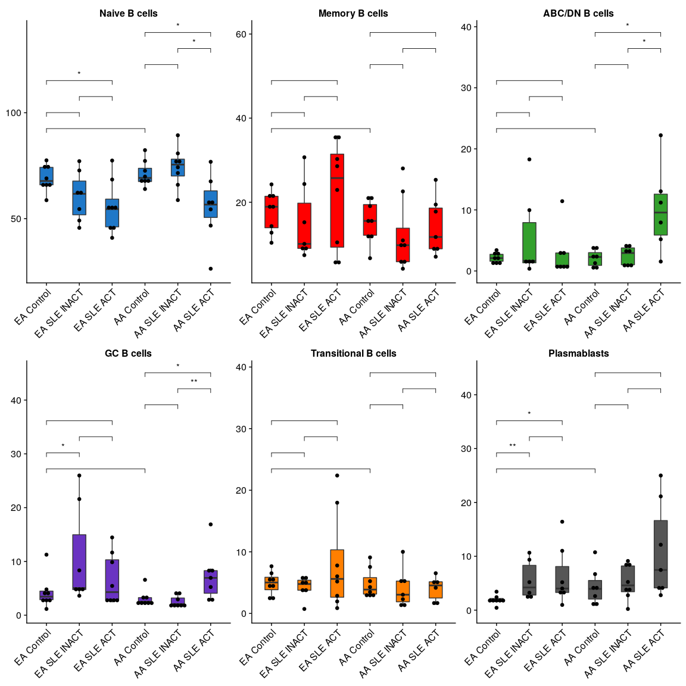

Figure 4
================
Kevin Thomas
20 January, 2022

-   [4A](#4a)
-   [4B](#4b)
-   [4C](#4c)
-   [4D-4I](#4d-4i)
-   [4L-4N + S18](#4l-4n--s18)

## 4A

``` r
DimPlot(
  object = sc,
  cells = WhichCells(
    object = sc,
    expression =
      `coarse_cell_type` %in% c("B cells", "Plasmablasts") &
      `wnnUMAP_1` > 4 &
      `wnnUMAP_2` < 0
    ),
  reduction = "umap_wnn",
  dims = c(1,2),
  group.by = "clusters_annotated",
  cols = set_names(cols25(n = length(levels(sc$clusters_annotated))), levels(sc$clusters_annotated)),
  label = TRUE,
  label.size = 4,
  repel = FALSE
) +
  theme(legend.position = "none") +
  labs(title = NULL, x = NULL, y = NULL) +
  coord_fixed()
```

<!-- -->

## 4B

``` r
# Generate CITEseq markers for B cells
b_markers_cite <-
  ## Look only at B cells and Plasmablasts
  subset(sc, `coarse_cell_type` %in% c("B cells", "Plasmablasts")) %>%
  ## Define CITEseq markers of each annotated cluster by fast wilcoxon test
  wilcoxauc(
    X = .,
    seurat_assay = "CITE",
    group_by = "clusters_annotated"
  ) |>
  as_tibble() |>
  dplyr::select(
    feature,
    cluster = group,
    p_val = pval,
    p_val_adj = padj,
    avg_logFC = logFC,
    pct.1 = pct_in,
    pct.2 = pct_out,
    auc
  ) |>
  ## Significance filter
  filter(p_val_adj <= 0.1) |>
  mutate(cluster = factor(cluster, levels = unique(cluster)[c(4, 3, 1, 2, 6, 5)])) |>
  group_by(cluster) |>
  ## Positive markers only, remove the isotype control
  filter(avg_logFC > 0, feature != "isotype-control") |>
  ## Rank markers in each cluster by average logFC
  arrange(-avg_logFC, by.group = TRUE) %>%
  ## If two clusters share a marker, the cluster with a higher average logFC is prioritized
  filter(
    avg_logFC == map_dbl(split(., use_series(., feature)), ~max(.x$avg_logFC))[feature]
  ) |>
  ## Top 3 features for each cluster
  slice_head(n = 3) |>
  use_series(feature)

# Bubbleplot
bubbleplot(
  object = subset(sc, `coarse_cell_type` %in% c("B cells", "Plasmablasts")),
  assay = "CITE",
  slot = "data",
  features_plot = b_markers_cite,
  preserve_feature_order = TRUE,
  grouping_var = "clusters_annotated",
  filter_exp_pct_thresh = 1,
  avg_func = "median",
  do_return = TRUE
) +
  scale_color_distiller(palette = "Reds", direction = 1) +
  labs(title = NULL, x = NULL, y = NULL, col = "Scaled median expression", size = "Percent cells expressing") +
  theme(axis.text.x = element_text(angle = 45, hjust = 1, vjust = 1))
```

    ## Scale for 'colour' is already present. Adding another scale for 'colour', which will replace the existing scale.

<!-- -->

## 4C

``` r
# Generate gene markers for B cells
b_markers_genes <-
  subset(sc, `coarse_cell_type` %in% c("B cells", "Plasmablasts")) |> 
  wilcoxauc(
    seurat_assay = "SCT",
    group_by = "clusters_annotated"
  ) |> 
  as_tibble() |> 
  dplyr::select(
    feature,
    cluster = group,
    p_val = pval,
    p_val_adj = padj,
    avg_logFC = logFC,
    pct.1 = pct_in,
    pct.2 = pct_out,
    auc
  ) |> 
  filter(p_val_adj <= 0.1) |> 
  mutate(cluster = factor(cluster, levels = unique(cluster)[c(4, 3, 1, 2, 6, 5)])) |> 
  group_by(cluster) |> 
  filter(auc > 0.55) |> 
  arrange(-auc, by.group = TRUE) %>%
  filter(
    auc == map_dbl(split(., use_series(., feature)), ~max(.x$auc))[feature]
  ) %>%
  slice_head(n = 5) |> 
  use_series(feature)

# Heatmap
scale <- function(x) {
  (x-min(x))/(max(x)-min(x))
}

mat <- FetchData(
  object = subset(sc, `coarse_cell_type` %in% c("B cells", "Plasmablasts")),
  vars = c("clusters_annotated", b_markers_genes)
) |> 
  as_tibble(rownames = "cell") |> 
  group_by(clusters_annotated) |> 
  summarize_if(is.numeric, mean) |> 
  mutate_at(b_markers_genes, scale) |> 
  as.data.frame() |> 
  column_to_rownames("clusters_annotated")

pheatmap(
  mat = t(mat),
  scale = "none",
  breaks = seq.int(from = 0, to = 1, length.out = 100),
  color = colorRampPalette(brewer.pal(n = 7, name = "Blues"))(100),
  cluster_rows = FALSE,
  cluster_cols = FALSE,
  angle_col = 90,
  legend = TRUE
)
```

<!-- -->

## 4D-4I

``` r
# Collect percent of B cells in each cluster per patient
vln_data <- FetchData(
    object = sc,
    vars = c("clusters_annotated", "subject_id", "ancestry", "classification"),
    cells = WhichCells(sc, expression = `coarse_cell_type` %in% c("B cells", "Plasmablasts"))
  ) |> 
  group_by(ancestry, classification, subject_id, clusters_annotated) |> 
  summarise(total_cells = n()) |> 
  mutate(
    percent_total = 100*total_cells/sum(total_cells),
    group = paste(ancestry, classification)
  )
```

    ## `summarise()` has grouped output by 'ancestry', 'classification', 'subject_id'. You can override using the `.groups` argument.

``` r
# Re-order factor levels
vln_data$group <- factor(
  x = vln_data$group,
  levels = c(
    "EA Control",
    "EA SLE INACT",
    "EA SLE ACT",
    "AA Control",
    "AA SLE INACT",
    "AA SLE ACT"
  )
)

# Violin plots for each cluster
vln_data %>%
  ggplot(
    aes(
      x = group, 
      y = percent_total
      )
    ) +
  geom_violin(
    aes(
      fill = clusters_annotated
      ),
    scale = "width"
    ) +
  scale_fill_manual(
    values = set_names(
      x = cols25(n = length(levels(vln_data$clusters_annotated))),
      nm = levels(vln_data$clusters_annotated)
    )
  ) +
  geom_boxplot(
    width = 0.2, 
    outlier.shape = NA
    ) +
  geom_jitter(
    width = 0.2, 
    size = 0.4
    ) +
  ## Show statistics for Wilcoxon comparisons
  stat_compare_means(
    aes(label = ..p.format..),
    method = "wilcox.test",
    method.args = list(
      formula = percent_total ~ group,
      p.adjust.method = "BH"
    ),
    comparisons = list(
      c("EA Control", "AA Control"),
      c("EA Control", "EA SLE INACT"),
      c("EA SLE INACT", "EA SLE ACT"),
      c("EA Control", "EA SLE ACT"),
      c("AA Control", "AA SLE INACT"),
      c("AA SLE INACT", "AA SLE ACT"),
      c("AA Control", "AA SLE ACT")
    ),
    hide.ns = TRUE,
    show.legend = TRUE,
    symnum.args = list(cutpoints = c(0, 0.0001, 0.001, 0.01, 0.05, Inf), symbols = c("****", "***", "**", "*", "ns"))
  ) +
  xlab(NULL) +
  ylab(NULL) +
  facet_wrap(~clusters_annotated, scales = "free", ncol = 3) +
  theme_cowplot() +
  theme(
    strip.background = element_blank(),
    strip.text = element_text(face = "bold"),
    legend.position = "none",
    axis.text.x =
      element_text(
        angle = 45,
        hjust = 1,
        vjust = 1
        )
  )
```

<!-- -->

## 4L-4N + S18

``` r
# Gather normalized expression data for heavy chain genes
ig_data <- FetchData(
    object = sc,
    vars = 
      c("clusters_annotated", "ancestry", "classification", "subject_id",
        grep(pattern = "^IGH", x = rownames(sc), value = TRUE)
        ),
    cells = WhichCells(
      sc,
      expression = `coarse_cell_type` %in% c("B cells", "Plasmablasts")
      )
  ) |> 
  select(
    clusters_annotated,
    ancestry,
    classification,
    subject_id,
    IGHD,
    IGHM,
    IGHA1,
    IGHA2,
    IGHG1,
    IGHG2,
    IGHG3,
    IGHG4,
    IGHE
  )

# Determine the heavy chain gene with the highest expression in each cell
ig_data$max_ig <- colnames(x = ig_data[,grep(pattern = "^IGH", colnames(x = ig_data))])[max.col(m =  ig_data[,grep("^IGH", colnames(ig_data))], ties.method = "first")]
# Summarize by disease group and plot results
ig_data |> 
  group_by(ancestry, classification, clusters_annotated, max_ig) |> 
  ## Tally total number of B cells in each study group predominantly expressing each Ig heavy chain
  tally() |> 
  mutate(
    ## Calculate percent of totals
    percent = 100*n/sum(n),
    ## Map the Ig class to each heavy chain gene
    ig_class = map_chr(
      max_ig,
      ~switch(
        .x,
        "IGHA1" = "IgA",
        "IGHA2" = "IgA",
        "IGHD" = "IgM",
        "IGHE" = "IgE",
        "IGHG1" = "IgG",
        "IGHG2" = "IgG",
        "IGHG3" = "IgG",
        "IGHG4" = "IgG",
        "IGHM" = "IgM"
      )
    ),
    ig_class = factor(ig_class, levels = c("IgA", "IgE", "IgG", "IgM")),
    ## Order the study groups
    group = factor(
      paste(ancestry, classification),
      levels = c(
        "EA Control",
        "EA SLE INACT",
        "EA SLE ACT",
        "AA Control",
        "AA SLE INACT",
        "AA SLE ACT"
      )
    )
  ) |> 
  ## Barplot
  ggplot(
    aes(
      x = group,
      y = percent, 
      fill = ig_class
      )
    ) +
  geom_bar(stat = 'identity') +
  labs(
    x = NULL, 
    y = "Percent of B cells",
    fill = NULL
    ) +
  facet_wrap(~clusters_annotated, scales = "free") +
  theme_cowplot() +
  theme(
    strip.background = element_blank(),
    strip.text = element_text(face = "bold"),
    axis.text.x = element_text(angle = 45, hjust = 1, vjust = 1)
  )
```

<!-- -->

``` r
session_info()
```

    ## ─ Session info ───────────────────────────────────────────────────────────────────────────────────────────────────────────────────────────────────────────────────────────────────────────────────────────────────────────────────────────────────────────────────────────────────────────────────────────────────────────────────────────────────────────────────────────────────────────────────────────────────────────────────────────────────────────────────────────────────────────────────────────────────────────────────────────────────────────────────────────────────────────────────────────────────────────────────────────────────────────────────────────────────────────────────────────────────────────────────────────────────────────────────────────────────────────────────────────────────────────────────────────────────────────────────────────────────────────────────────────────────────────────────────────────────────────────────────────────────────────────────────────────────────────────────────────────────────────────────────────────────────────────────────────────────────────────────────────────────────────────────────────────────────────────────────────────────────────────────────────────
    ##  setting  value
    ##  version  R version 4.1.2 (2021-11-01)
    ##  os       Ubuntu 20.04.3 LTS
    ##  system   x86_64, linux-gnu
    ##  ui       X11
    ##  language (EN)
    ##  collate  en_US.UTF-8
    ##  ctype    en_US.UTF-8
    ##  tz       Etc/UTC
    ##  date     2022-01-20
    ##  pandoc   2.14.0.3 @ /usr/lib/rstudio-server/bin/pandoc/ (via rmarkdown)
    ## 
    ## ─ Packages ───────────────────────────────────────────────────────────────────────────────────────────────────────────────────────────────────────────────────────────────────────────────────────────────────────────────────────────────────────────────────────────────────────────────────────────────────────────────────────────────────────────────────────────────────────────────────────────────────────────────────────────────────────────────────────────────────────────────────────────────────────────────────────────────────────────────────────────────────────────────────────────────────────────────────────────────────────────────────────────────────────────────────────────────────────────────────────────────────────────────────────────────────────────────────────────────────────────────────────────────────────────────────────────────────────────────────────────────────────────────────────────────────────────────────────────────────────────────────────────────────────────────────────────────────────────────────────────────────────────────────────────────────────────────────────────────────────────────────────────────────────────────────────────────────────────────────────────────────
    ##  package          * version  date (UTC) lib source
    ##  abind              1.4-5    2016-07-21 [1] RSPM (R 4.1.0)
    ##  AnnotationDbi      1.56.2   2021-11-09 [1] Bioconductor
    ##  backports          1.4.1    2021-12-13 [1] RSPM (R 4.1.0)
    ##  bayesm             3.1-4    2019-10-15 [1] RSPM (R 4.1.0)
    ##  Biobase            2.54.0   2021-10-26 [1] Bioconductor
    ##  BiocGenerics       0.40.0   2021-10-26 [1] Bioconductor
    ##  BiocManager      * 1.30.16  2021-06-15 [1] RSPM (R 4.1.0)
    ##  Biostrings         2.62.0   2021-10-26 [1] Bioconductor
    ##  bit                4.0.4    2020-08-04 [1] RSPM (R 4.1.0)
    ##  bit64              4.0.5    2020-08-30 [1] RSPM (R 4.1.0)
    ##  bitops             1.0-7    2021-04-24 [1] RSPM (R 4.1.0)
    ##  blob               1.2.2    2021-07-23 [1] RSPM (R 4.1.0)
    ##  broom              0.7.11   2022-01-03 [1] RSPM (R 4.1.0)
    ##  cachem             1.0.6    2021-08-19 [1] RSPM (R 4.1.0)
    ##  callr              3.7.0    2021-04-20 [1] RSPM (R 4.1.0)
    ##  car                3.0-12   2021-11-06 [1] RSPM (R 4.1.0)
    ##  carData            3.0-5    2022-01-06 [1] RSPM (R 4.1.0)
    ##  cli                3.1.0    2021-10-27 [1] RSPM (R 4.1.0)
    ##  cluster            2.1.2    2021-04-17 [2] CRAN (R 4.1.2)
    ##  codetools          0.2-18   2020-11-04 [2] CRAN (R 4.1.2)
    ##  colorspace         2.0-2    2021-06-24 [1] RSPM (R 4.1.0)
    ##  compositions       2.0-4    2022-01-05 [1] RSPM (R 4.1.0)
    ##  cowplot          * 1.1.1    2020-12-30 [1] RSPM (R 4.1.0)
    ##  crayon             1.4.2    2021-10-29 [1] RSPM (R 4.1.0)
    ##  data.table       * 1.14.2   2021-09-27 [1] RSPM (R 4.1.0)
    ##  DBI                1.1.2    2021-12-20 [1] RSPM (R 4.1.0)
    ##  deldir             1.0-6    2021-10-23 [1] RSPM (R 4.1.0)
    ##  DEoptimR           1.0-10   2022-01-03 [1] RSPM (R 4.1.0)
    ##  desc               1.4.0    2021-09-28 [1] RSPM (R 4.1.0)
    ##  devtools         * 2.4.3    2021-11-30 [1] RSPM (R 4.1.0)
    ##  dichromat          2.0-0    2013-01-24 [1] RSPM (R 4.1.0)
    ##  digest             0.6.29   2021-12-01 [1] RSPM (R 4.1.0)
    ##  dplyr            * 1.0.7    2021-06-18 [1] RSPM (R 4.1.0)
    ##  ellipsis           0.3.2    2021-04-29 [1] RSPM (R 4.1.0)
    ##  evaluate           0.14     2019-05-28 [1] RSPM (R 4.1.0)
    ##  fansi              1.0.2    2022-01-14 [1] RSPM (R 4.1.0)
    ##  farver             2.1.0    2021-02-28 [1] RSPM (R 4.1.0)
    ##  fastmap            1.1.0    2021-01-25 [1] RSPM (R 4.1.0)
    ##  fitdistrplus       1.1-6    2021-09-28 [1] RSPM (R 4.1.0)
    ##  fs                 1.5.2    2021-12-08 [1] RSPM (R 4.1.0)
    ##  future             1.23.0   2021-10-31 [1] RSPM (R 4.1.0)
    ##  future.apply       1.8.1    2021-08-10 [1] RSPM (R 4.1.0)
    ##  generics           0.1.1    2021-10-25 [1] RSPM (R 4.1.0)
    ##  GenomeInfoDb       1.30.0   2021-10-26 [1] Bioconductor
    ##  GenomeInfoDbData   1.2.7    2022-01-20 [1] Bioconductor
    ##  ggplot2          * 3.3.5    2021-06-25 [1] RSPM (R 4.1.0)
    ##  ggpubr           * 0.4.0    2020-06-27 [1] RSPM (R 4.1.0)
    ##  ggrepel            0.9.1    2021-01-15 [1] RSPM (R 4.1.0)
    ##  ggridges           0.5.3    2021-01-08 [1] RSPM (R 4.1.0)
    ##  ggsignif           0.6.3    2021-09-09 [1] RSPM (R 4.1.0)
    ##  globals            0.14.0   2020-11-22 [1] RSPM (R 4.1.0)
    ##  glue               1.6.0    2021-12-17 [1] RSPM (R 4.1.0)
    ##  goftest            1.2-3    2021-10-07 [1] RSPM (R 4.1.0)
    ##  gridExtra          2.3      2017-09-09 [1] RSPM (R 4.1.0)
    ##  gtable             0.3.0    2019-03-25 [1] RSPM (R 4.1.0)
    ##  gtools             3.9.2    2021-06-06 [1] RSPM (R 4.1.0)
    ##  here             * 1.0.1    2020-12-13 [1] RSPM (R 4.1.0)
    ##  HGNChelper         0.8.1    2019-10-24 [1] RSPM (R 4.1.0)
    ##  highr              0.9      2021-04-16 [1] RSPM (R 4.1.0)
    ##  htmltools          0.5.2    2021-08-25 [1] RSPM (R 4.1.0)
    ##  htmlwidgets        1.5.4    2021-09-08 [1] RSPM (R 4.1.0)
    ##  httpuv             1.6.5    2022-01-05 [1] RSPM (R 4.1.0)
    ##  httr               1.4.2    2020-07-20 [1] RSPM (R 4.1.0)
    ##  ica                1.0-2    2018-05-24 [1] RSPM (R 4.1.0)
    ##  igraph             1.2.11   2022-01-04 [1] RSPM (R 4.1.0)
    ##  IRanges            2.28.0   2021-10-26 [1] Bioconductor
    ##  irlba              2.3.5    2021-12-06 [1] RSPM (R 4.1.0)
    ##  jsonlite           1.7.3    2022-01-17 [1] RSPM (R 4.1.0)
    ##  KEGGREST           1.34.0   2021-10-26 [1] Bioconductor
    ##  KernSmooth         2.23-20  2021-05-03 [2] CRAN (R 4.1.2)
    ##  knitr              1.37     2021-12-16 [1] RSPM (R 4.1.0)
    ##  labeling           0.4.2    2020-10-20 [1] RSPM (R 4.1.0)
    ##  later              1.3.0    2021-08-18 [1] RSPM (R 4.1.0)
    ##  lattice            0.20-45  2021-09-22 [2] CRAN (R 4.1.2)
    ##  lazyeval           0.2.2    2019-03-15 [1] RSPM (R 4.1.0)
    ##  leiden             0.3.9    2021-07-27 [1] RSPM (R 4.1.0)
    ##  lifecycle          1.0.1    2021-09-24 [1] RSPM (R 4.1.0)
    ##  listenv            0.8.0    2019-12-05 [1] RSPM (R 4.1.0)
    ##  lmtest             0.9-39   2021-11-07 [1] RSPM (R 4.1.0)
    ##  magrittr         * 2.0.1    2020-11-17 [1] RSPM (R 4.1.0)
    ##  mapproj            1.2.8    2022-01-12 [1] RSPM (R 4.1.0)
    ##  maps               3.4.0    2021-09-25 [1] RSPM (R 4.1.0)
    ##  MASS               7.3-54   2021-05-03 [2] CRAN (R 4.1.2)
    ##  Matrix             1.3-4    2021-06-01 [2] CRAN (R 4.1.2)
    ##  matrixStats        0.61.0   2021-09-17 [1] RSPM (R 4.1.0)
    ##  memoise            2.0.1    2021-11-26 [1] RSPM (R 4.1.0)
    ##  mgcv               1.8-38   2021-10-06 [2] CRAN (R 4.1.2)
    ##  mime               0.12     2021-09-28 [1] RSPM (R 4.1.0)
    ##  miniUI             0.1.1.1  2018-05-18 [1] RSPM (R 4.1.0)
    ##  munsell            0.5.0    2018-06-12 [1] RSPM (R 4.1.0)
    ##  nlme               3.1-153  2021-09-07 [2] CRAN (R 4.1.2)
    ##  org.Hs.eg.db       3.14.0   2022-01-20 [1] Bioconductor
    ##  pals             * 1.7      2021-04-17 [1] RSPM (R 4.1.0)
    ##  parallelly         1.30.0   2021-12-17 [1] RSPM (R 4.1.0)
    ##  patchwork          1.1.1    2020-12-17 [1] RSPM (R 4.1.0)
    ##  pbapply            1.5-0    2021-09-16 [1] RSPM (R 4.1.0)
    ##  pheatmap         * 1.0.12   2019-01-04 [1] RSPM (R 4.1.0)
    ##  pillar             1.6.4    2021-10-18 [1] RSPM (R 4.1.0)
    ##  pkgbuild           1.3.1    2021-12-20 [1] RSPM (R 4.1.0)
    ##  pkgconfig          2.0.3    2019-09-22 [1] RSPM (R 4.1.0)
    ##  pkgload            1.2.4    2021-11-30 [1] RSPM (R 4.1.0)
    ##  plotly             4.10.0   2021-10-09 [1] RSPM (R 4.1.0)
    ##  plyr               1.8.6    2020-03-03 [1] RSPM (R 4.1.0)
    ##  png                0.1-7    2013-12-03 [1] RSPM (R 4.1.0)
    ##  polyclip           1.10-0   2019-03-14 [1] RSPM (R 4.1.0)
    ##  presto           * 1.0.0    2022-01-20 [1] Github (immunogenomics/presto@052085d)
    ##  prettyunits        1.1.1    2020-01-24 [1] RSPM (R 4.1.0)
    ##  processx           3.5.2    2021-04-30 [1] RSPM (R 4.1.0)
    ##  promises           1.2.0.1  2021-02-11 [1] RSPM (R 4.1.0)
    ##  ps                 1.6.0    2021-02-28 [1] RSPM (R 4.1.0)
    ##  purrr            * 0.3.4    2020-04-17 [1] RSPM (R 4.1.0)
    ##  R6                 2.5.1    2021-08-19 [1] RSPM (R 4.1.0)
    ##  RANN               2.6.1    2019-01-08 [1] RSPM (R 4.1.0)
    ##  RColorBrewer     * 1.1-2    2014-12-07 [1] RSPM (R 4.1.0)
    ##  Rcpp             * 1.0.8    2022-01-13 [1] RSPM (R 4.1.0)
    ##  RcppAnnoy          0.0.19   2021-07-30 [1] RSPM (R 4.1.0)
    ##  RCurl              1.98-1.5 2021-09-17 [1] RSPM (R 4.1.0)
    ##  remotes            2.4.2    2021-11-30 [1] RSPM (R 4.1.0)
    ##  reshape2           1.4.4    2020-04-09 [1] RSPM (R 4.1.0)
    ##  reticulate         1.23     2022-01-14 [1] RSPM (R 4.1.0)
    ##  rlang            * 0.4.12   2021-10-18 [1] RSPM (R 4.1.0)
    ##  rmarkdown          2.11     2021-09-14 [1] RSPM (R 4.1.0)
    ##  robustbase         0.93-9   2021-09-27 [1] RSPM (R 4.1.0)
    ##  ROCR               1.0-11   2020-05-02 [1] RSPM (R 4.1.0)
    ##  rpart              4.1-15   2019-04-12 [2] CRAN (R 4.1.2)
    ##  rprojroot          2.0.2    2020-11-15 [1] RSPM (R 4.1.0)
    ##  RSQLite            2.2.9    2021-12-06 [1] RSPM (R 4.1.0)
    ##  rstatix            0.7.0    2021-02-13 [1] RSPM (R 4.1.0)
    ##  rstudioapi         0.13     2020-11-12 [1] RSPM (R 4.1.0)
    ##  Rtsne              0.15     2018-11-10 [1] RSPM (R 4.1.0)
    ##  S4Vectors          0.32.3   2021-11-21 [1] Bioconductor
    ##  scales             1.1.1    2020-05-11 [1] RSPM (R 4.1.0)
    ##  scattermore        0.7      2020-11-24 [1] RSPM (R 4.1.0)
    ##  sctransform        0.3.3    2022-01-13 [1] RSPM (R 4.1.0)
    ##  sessioninfo        1.2.2    2021-12-06 [1] RSPM (R 4.1.0)
    ##  Seurat           * 4.1.0    2022-01-14 [1] RSPM (R 4.1.0)
    ##  SeuratBubblePlot * 0.5.0    2022-01-20 [1] Github (milescsmith/SeuratBubblePlot@c3f7752)
    ##  SeuratObject     * 4.0.4    2021-11-23 [1] RSPM (R 4.1.0)
    ##  shiny              1.7.1    2021-10-02 [1] RSPM (R 4.1.0)
    ##  spatstat.core      2.3-2    2021-11-26 [1] RSPM (R 4.1.0)
    ##  spatstat.data      2.1-2    2021-12-17 [1] RSPM (R 4.1.0)
    ##  spatstat.geom      2.3-1    2021-12-10 [1] RSPM (R 4.1.0)
    ##  spatstat.sparse    2.1-0    2021-12-17 [1] RSPM (R 4.1.0)
    ##  spatstat.utils     2.3-0    2021-12-12 [1] RSPM (R 4.1.0)
    ##  stringi            1.7.6    2021-11-29 [1] RSPM (R 4.1.0)
    ##  stringr            1.4.0    2019-02-10 [1] RSPM (R 4.1.0)
    ##  survival           3.2-13   2021-08-24 [2] CRAN (R 4.1.2)
    ##  tensor             1.5      2012-05-05 [1] RSPM (R 4.1.0)
    ##  tensorA            0.36.2   2020-11-19 [1] RSPM (R 4.1.0)
    ##  testthat           3.1.1    2021-12-03 [1] RSPM (R 4.1.0)
    ##  tibble           * 3.1.6    2021-11-07 [1] RSPM (R 4.1.0)
    ##  tidyr              1.1.4    2021-09-27 [1] RSPM (R 4.1.0)
    ##  tidyselect         1.1.1    2021-04-30 [1] RSPM (R 4.1.0)
    ##  usethis          * 2.1.5    2021-12-09 [1] RSPM (R 4.1.0)
    ##  utf8               1.2.2    2021-07-24 [1] RSPM (R 4.1.0)
    ##  uwot               0.1.11   2021-12-02 [1] RSPM (R 4.1.0)
    ##  vctrs              0.3.8    2021-04-29 [1] RSPM (R 4.1.0)
    ##  viridis            0.6.2    2021-10-13 [1] RSPM (R 4.1.0)
    ##  viridisLite        0.4.0    2021-04-13 [1] RSPM (R 4.1.0)
    ##  withr              2.4.3    2021-11-30 [1] RSPM (R 4.1.0)
    ##  xfun               0.29     2021-12-14 [1] RSPM (R 4.1.0)
    ##  xtable             1.8-4    2019-04-21 [1] RSPM (R 4.1.0)
    ##  XVector            0.34.0   2021-10-26 [1] Bioconductor
    ##  yaml               2.2.1    2020-02-01 [1] RSPM (R 4.1.0)
    ##  zlibbioc           1.40.0   2021-10-26 [1] Bioconductor
    ##  zoo                1.8-9    2021-03-09 [1] RSPM (R 4.1.0)
    ## 
    ##  [1] /usr/local/lib/R/site-library
    ##  [2] /usr/local/lib/R/library
    ## 
    ## ──────────────────────────────────────────────────────────────────────────────────────────────────────────────────────────────────────────────────────────────────────────────────────────────────────────────────────────────────────────────────────────────────────────────────────────────────────────────────────────────────────────────────────────────────────────────────────────────────────────────────────────────────────────────────────────────────────────────────────────────────────────────────────────────────────────────────────────────────────────────────────────────────────────────────────────────────────────────────────────────────────────────────────────────────────────────────────────────────────────────────────────────────────────────────────────────────────────────────────────────────────────────────────────────────────────────────────────────────────────────────────────────────────────────────────────────────────────────────────────────────────────────────────────────────────────────────────────────────────────────────────────────────────────────────────────────────────────────────────────────────────────────────────────────────────────────────────────────────────────────
