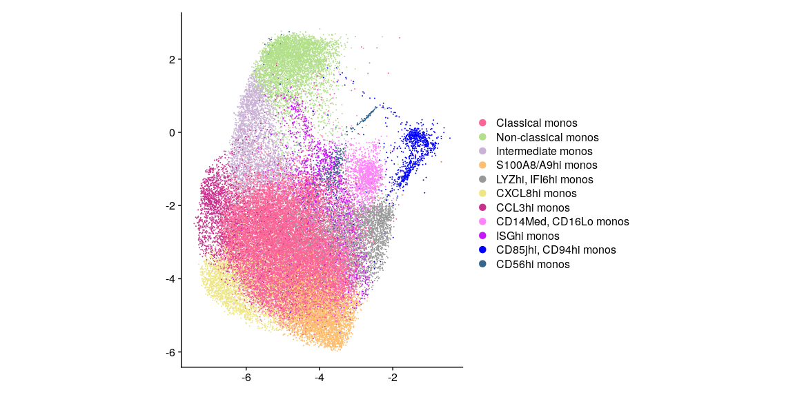
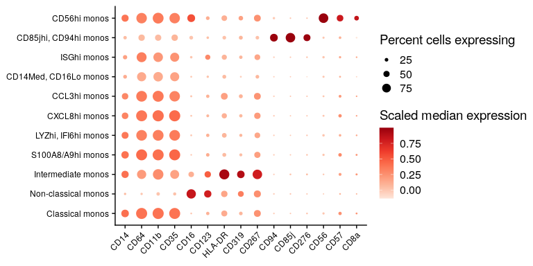
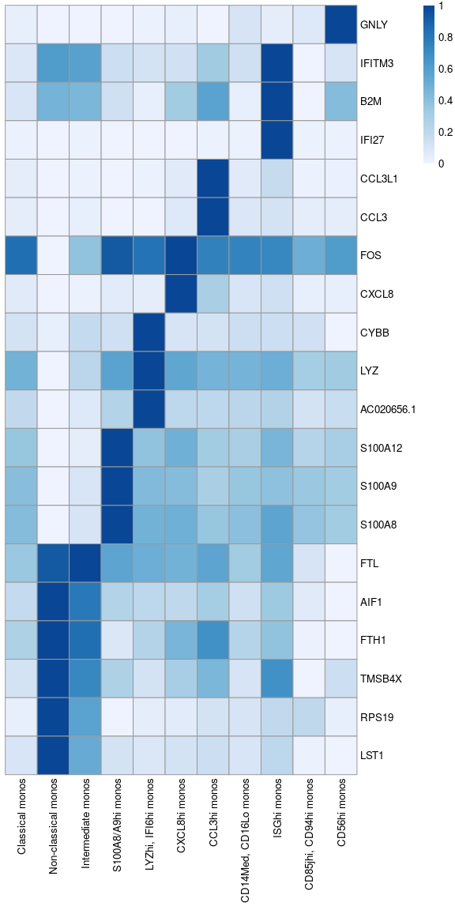
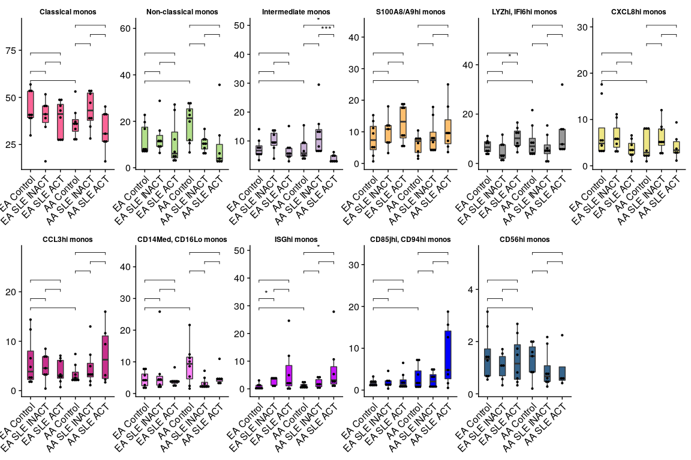
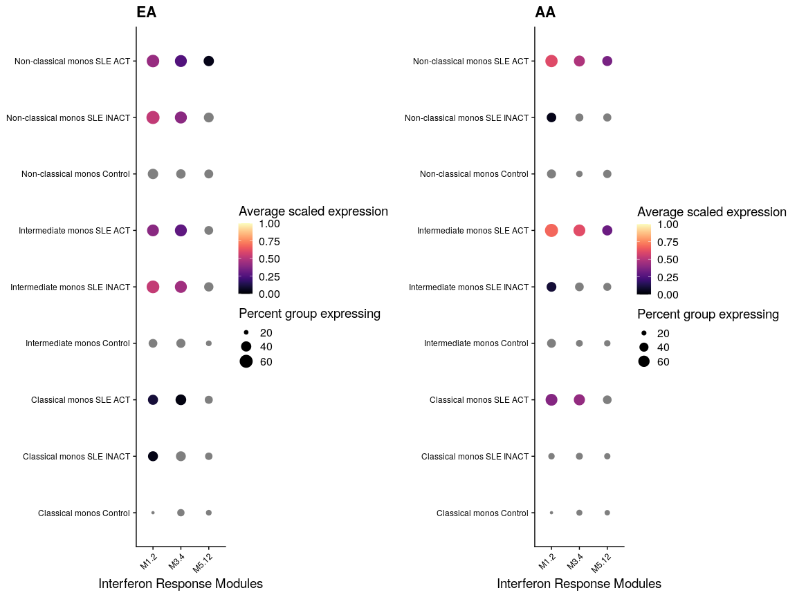
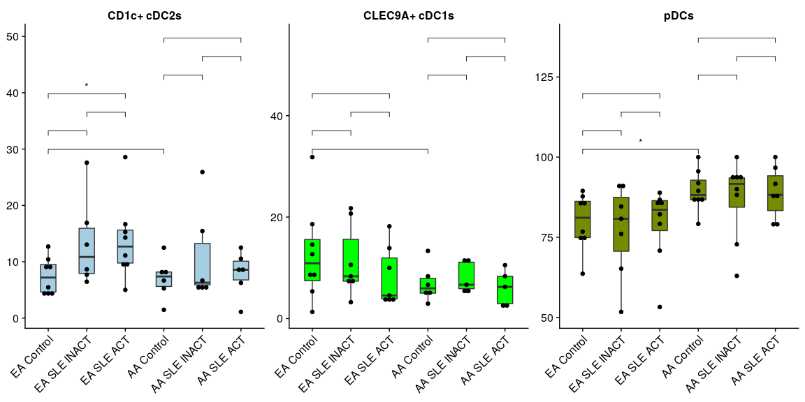
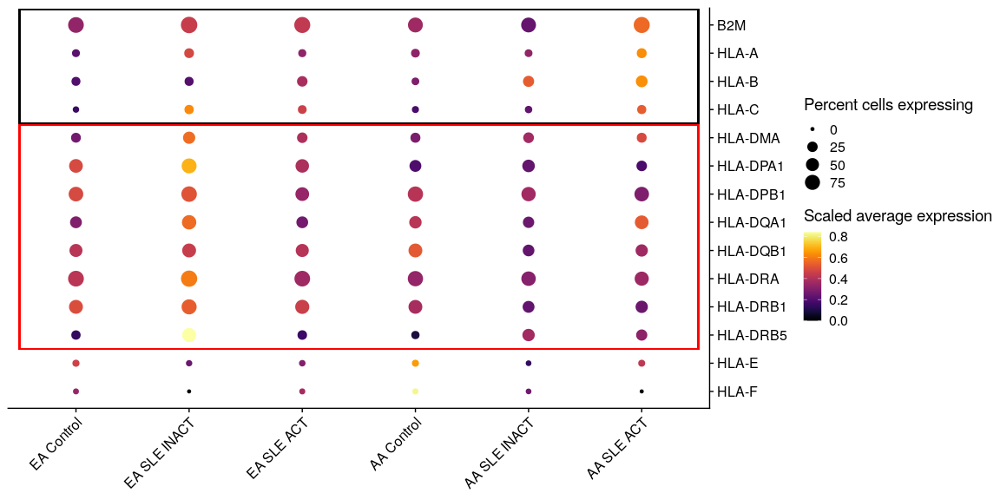

Figure 5
================
Kevin Thomas
25 April, 2022

-   [5A](#5a)
-   [5B](#5b)
-   [5C](#5c)
-   [5D-5G, S19A-S19G](#5d-5g-s19a-s19g)
-   [5H](#5h)
-   [5I-5K](#5i-5k)
-   [5L](#5l)

## 5A

``` r
mono_clusters <- filter(
    .data = sc@meta.data, 
    coarse_cell_type == "Monocytes"
  ) |> 
  pull(clusters_annotated) |> 
  unique()

DimPlot(
  object = sc,
  cells = WhichCells(object = sc, expression = `coarse_cell_type` %in% c("Monocytes") & `wnnUMAP_1` < 0 & `wnnUMAP_2` < 3),
  reduction = "umap_wnn",
  dims = c(1,2),
  group.by = "clusters_annotated",
  cols = set_names(
    x = cols25(n = length(levels(sc$clusters_annotated))),
    levels(sc$clusters_annotated))[levels(sc$clusters_annotated) %in% mono_clusters]
  ) +
  labs(title = NULL, x = NULL, y = NULL) +
  coord_fixed()
```

<!-- -->

## 5B

``` r
# Generate CITEseq markers for Monocytes
mono_markers_cite <-
  ## Look only at Monocytes
  subset(sc, `coarse_cell_type` %in% c("Monocytes")) %>%
  ## Define CITEseq markers of each annotated cluster by fast wilcoxon test
  wilcoxauc(
    X = .,
    seurat_assay = "CITE",
    group_by = "clusters_annotated"
  ) |> 
  as_tibble() |> 
  dplyr::select(
    feature,
    cluster = group,
    p_val = pval,
    p_val_adj = padj,
    avg_logFC = logFC,
    pct.1 = pct_in,
    pct.2 = pct_out,
    auc
  ) |> 
  ## Significance filter
  filter(p_val_adj <= 0.1) |> 
  mutate(cluster = factor(cluster, levels = unique(cluster)[c(5, 10, 7, 11, 9, 6, 1, 2, 8, 4, 3)])) |> 
  group_by(cluster) |> 
  ## Positive markers only, remove the isotype control
  filter(avg_logFC > 0, feature != "isotype-control") |> 
  ## Rank markers in each cluster by average logFC
  arrange(-avg_logFC, by.group = TRUE) %>%
  ## If two clusters share a marker, the cluster with a higher average logFC is prioritized
  filter(
    avg_logFC == map_dbl(split(., use_series(., feature)), ~max(use_series(.x, avg_logFC)))[feature]
  ) |> 
  ## Top 3 features for each cluster
  slice_head(n = 3) |> 
  use_series(feature)

# Bubbleplot
bubbleplot(
  object = subset(sc, `coarse_cell_type` %in% c("Monocytes")),
  assay = "CITE",
  slot = "data",
  features_plot = c("CD14", mono_markers_cite),
  preserve_feature_order = TRUE,
  grouping_var = "clusters_annotated",
  filter_exp_pct_thresh = 1,
  avg_func = "median",
  do_return = TRUE
) +
  scale_color_distiller(palette = "Reds", direction = 1) +
  labs(title = NULL, x = NULL, y = NULL, col = "Scaled median expression", size = "Percent cells expressing") +
  theme(axis.text.x = element_text(angle = 45, hjust = 1, vjust = 1))
```

    ## Scale for 'colour' is already present. Adding another scale for 'colour', which will replace the existing scale.

<!-- -->

## 5C

``` r
# Generate gene markers for Monocytes
mono_markers_genes <-
  subset(sc, `coarse_cell_type` %in% c("Monocytes")) %>%
  wilcoxauc(
    X = .,
    seurat_assay = "SCT",
    group_by = "clusters_annotated"
  ) |> 
  as_tibble() |> 
  dplyr::select(
    feature,
    cluster = group,
    p_val = pval,
    p_val_adj = padj,
    avg_logFC = logFC,
    pct.1 = pct_in,
    pct.2 = pct_out,
    auc
  ) |> 
  filter(p_val_adj <= 0.1) |> 
  mutate(cluster = factor(cluster, levels = unique(cluster)[c(5, 10, 7, 11, 9, 6, 1, 2, 8, 4, 3)])) |> 
  group_by(cluster) |> 
  filter(auc > 0.6) |> 
  arrange(-auc, by.group = TRUE) %>%
  filter(
    auc == map_dbl(split(., use_series(.,feature)), ~max(use_series(.x, auc)))[feature]
  ) |> 
  slice_head(n = 5) |> 
  use_series(feature)

# Heatmap
scale <- function(x) {
  (x-min(x))/(max(x)-min(x))
}

mat <- FetchData(
  object = subset(sc, `coarse_cell_type` %in% c("Monocytes")),
  vars = c("clusters_annotated", rev(mono_markers_genes))
) |> 
  as_tibble(rownames = "cell") |> 
  group_by(clusters_annotated) |> 
  summarise(across(where(is.numeric), mean)) |> 
  mutate(across(mono_markers_genes, scale)) |> 
  column_to_rownames(var = "clusters_annotated")
```

    ## Note: Using an external vector in selections is ambiguous.
    ## ℹ Use `all_of(mono_markers_genes)` instead of `mono_markers_genes` to silence this message.
    ## ℹ See <https://tidyselect.r-lib.org/reference/faq-external-vector.html>.
    ## This message is displayed once per session.

``` r
pheatmap(
  mat = t(mat),
  scale = "none",
  breaks = seq.int(from = 0, to = 1, length.out = 100),
  color = colorRampPalette(RColorBrewer::brewer.pal(n = 7, name = "Blues"))(100),
  cluster_rows = FALSE,
  cluster_cols = FALSE,
  angle_col = 90
)
```

<!-- -->

## 5D-5G, S19A-S19G

``` r
# Collect percent of Monocytes in each cluster per patient
dtplt_data <- FetchData(
    object = sc,
    vars = c("clusters_annotated", "subject_id", "ancestry", "classification"),
    cells = WhichCells(sc, expression = `coarse_cell_type` %in% c("Monocytes"))
  ) |> 
  group_by(ancestry, classification, subject_id, clusters_annotated) |> 
  summarise(total_cells = n()) |> 
  mutate(
    percent_total = 100*total_cells/sum(total_cells),
    group = paste(ancestry, classification)
  )
```

    ## `summarise()` has grouped output by 'ancestry', 'classification', 'subject_id'. You can override using the `.groups` argument.

``` r
# Re-order factor levels
dtplt_data$group <- factor(
  x = dtplt_data$group,
  levels = c(
    "EA Control",
    "EA SLE INACT",
    "EA SLE ACT",
    "AA Control",
    "AA SLE INACT",
    "AA SLE ACT"
  )
)
```

``` r
# Dot plots for each cluster
dtplt_data |> 
  ggplot(
    aes(
      x = group, 
      y = percent_total
      )
    ) +
  geom_boxplot(
    aes(fill = clusters_annotated),
    width = 0.4, 
    outlier.shape = NA
    ) +
  scale_fill_manual(
    values = set_names(
      x = cols25(n = length(levels(dtplt_data$clusters_annotated))),
      nm = levels(dtplt_data$clusters_annotated)
    )
  ) +
  geom_dotplot(
    binaxis = "y",
    stackdir = "center",
    dotsize = 0.75,
    width = 0.4
  ) +
  ## Show statistics for Wilcoxon comparisons
  stat_compare_means(
    aes(label = ..p.format..),
    method = "wilcox.test",
    method.args = list(
      formula = percent_total ~ group,
      p.adjust.method = "BH"
    ),
    comparisons = list(
      c("EA Control", "AA Control"),
      c("EA Control", "EA SLE INACT"),
      c("EA SLE INACT", "EA SLE ACT"),
      c("EA Control", "EA SLE ACT"),
      c("AA Control", "AA SLE INACT"),
      c("AA SLE INACT", "AA SLE ACT"),
      c("AA Control", "AA SLE ACT")
    ),
    hide.ns = TRUE,
    show.legend = TRUE,
    symnum.args = list(cutpoints = c(0, 0.0001, 0.001, 0.01, 0.05, Inf), symbols = c("****", "***", "**", "*", "ns"))
  ) +
  xlab(NULL) +
  ylab(NULL) +
  facet_wrap(~clusters_annotated, scales = "free", ncol = 6) +
  theme_cowplot() +
  theme(
    strip.background = element_blank(),
    strip.text = element_text(face = "bold", size = 9),
    legend.position = "none",
    axis.text.x = element_text(angle = 45, hjust = 1, vjust = 1)
  )
```

    ## Bin width defaults to 1/30 of the range of the data. Pick better value with `binwidth`.

    ## Warning in wilcox.test.default(c(5.26315789473684, 2.42261103633917, 13.3879781420765, : cannot compute exact p-value with ties

    ## Warning in wilcox.test.default(c(6.41803989592368, 8, 7.69230769230769, : cannot compute exact p-value with ties

    ## Warning in wilcox.test.default(c(6.41803989592368, 8, 7.69230769230769, : cannot compute exact p-value with ties

    ## Warning in wilcox.test.default(c(4.42324371205551, 21.6, 15.3846153846154, : cannot compute exact p-value with ties

    ## Warning in wilcox.test.default(c(1.99479618386817, 2.4, 1.92307692307692, : cannot compute exact p-value with ties

    ## Warning in wilcox.test.default(c(1.561144839549, 11.2, 21.6346153846154, : cannot compute exact p-value with ties

    ## Warning in wilcox.test.default(c(4.96031746031746, 2.50696378830084, 1.93236714975845, : cannot compute exact p-value with ties

<!-- -->

## 5H

``` r
monos_scored <- subset(
  sc_scored,
  `clusters_annotated` %in% c("Classical monos", "Intermediate monos", "Non-classical monos")
)
grid <- expand.grid(levels(monos_scored$classification), str_sort(unique(monos_scored$clusters_annotated)))
monos_scored$cluster_class <- factor(
  paste(monos_scored$clusters_annotated, monos_scored$classification),
  levels = paste(grid$Var2, grid$Var1)
)

plot_grid(
  bubbleplot(
    object = subset(monos_scored, `ancestry` == "EA"),
    features_plot = c("M1.2", "M3.4", "M5.12"),
    preserve_feature_order = TRUE,
    grouping_var = "cluster_class",
    colors_use = "magma",
  ) +
  scale_size_continuous(breaks = c(20, 40, 60, 80)) +
  labs(title = "EA", y = NULL, x = "Interferon Response Modules"),

  bubbleplot(
    object = subset(monos_scored, `ancestry` == "AA"),
    features_plot = c("M1.2", "M3.4", "M5.12"),
    preserve_feature_order = TRUE,
    grouping_var = "cluster_class",
    colors_use = "magma",
  ) +
    scale_size_continuous(breaks = c(20, 40, 60)) +
    labs(title = "AA", y = NULL, x = "Interferon Response Modules")
)
```

    ## Scale for 'size' is already present. Adding another scale for 'size', which will replace the existing scale.
    ## Scale for 'size' is already present. Adding another scale for 'size', which will replace the existing scale.

<!-- -->

## 5I-5K

``` r
# DC Dot plots
# Collect percent of Dendritic cells in each cluster per patient
dtplt_data <- FetchData(
    object = sc,
    vars = c("clusters_annotated", "subject_id", "ancestry", "classification"),
    cells = WhichCells(sc, expression = `coarse_cell_type` %in% c("cDCs", "pDCs"))
  ) |> 
  group_by(ancestry, classification, subject_id, clusters_annotated) |> 
  summarise(total_cells = n()) |> 
  mutate(
    percent_total = 100*total_cells/sum(total_cells),
    group = paste(ancestry, classification)
  )
```

    ## `summarise()` has grouped output by 'ancestry', 'classification', 'subject_id'. You can override using the `.groups` argument.

``` r
# Re-order factor levels
dtplt_data$group <- factor(
  x = dtplt_data$group,
  levels = c(
    "EA Control",
    "EA SLE INACT",
    "EA SLE ACT",
    "AA Control",
    "AA SLE INACT",
    "AA SLE ACT"
  )
)
```

``` r
# Dot plots for each cluster
dtplt_data %>%
  ggplot(
    aes(
      x = group, 
      y = percent_total
      )
    ) +
  geom_boxplot(
    aes(fill = clusters_annotated),
    width = 0.4, 
    outlier.shape = NA
    ) +
  scale_fill_manual(
    values = set_names(
      x = cols25(n = length(levels(dtplt_data$clusters_annotated))),
      nm = levels(dtplt_data$clusters_annotated)
    )
  ) +
  geom_dotplot(
    binaxis = "y",
    stackdir = "center",
    dotsize = 0.75,
    width = 0.4
  ) +
  ## Show statistics for Wilcoxon comparisons
  stat_compare_means(
    aes(label = ..p.format..),
    method = "wilcox.test",
    method.args = list(
      formula = percent_total ~ group,
      p.adjust.method = "BH"
    ),
    comparisons = list(
      c("EA Control", "AA Control"),
      c("EA Control", "EA SLE INACT"),
      c("EA SLE INACT", "EA SLE ACT"),
      c("EA Control", "EA SLE ACT"),
      c("AA Control", "AA SLE INACT"),
      c("AA SLE INACT", "AA SLE ACT"),
      c("AA Control", "AA SLE ACT")
    ),
    hide.ns = TRUE,
    show.legend = TRUE,
    symnum.args = list(cutpoints = c(0, 0.0001, 0.001, 0.01, 0.05, Inf), symbols = c("****", "***", "**", "*", "ns"))
  ) +
  xlab(NULL) +
  ylab(NULL) +
  facet_wrap(~clusters_annotated, scales = "free", ncol = 6) +
  theme_cowplot() +
  theme(
    strip.background = element_blank(),
    strip.text = element_text(face = "bold", size = 12),
    legend.position = "none",
    axis.text.x = element_text(angle = 45, hjust = 1, vjust = 1)
  )
```

    ## Bin width defaults to 1/30 of the range of the data. Pick better value with `binwidth`.

    ## Warning in wilcox.test.default(c(1.47058823529412, 5.26315789473684, 12.5, : cannot compute exact p-value with ties

    ## Warning in wilcox.test.default(c(1.47058823529412, 5.26315789473684, 12.5, : cannot compute exact p-value with ties

    ## Warning in wilcox.test.default(c(5, 5.88235294117647, 6.66666666666667, : cannot compute exact p-value with ties

    ## Warning in wilcox.test.default(c(2.94117647058824, 13.3333333333333, 5.26315789473684, : cannot compute exact p-value with ties

    ## Warning in wilcox.test.default(c(2.94117647058824, 13.3333333333333, 5.26315789473684, : cannot compute exact p-value with ties

    ## Warning in wilcox.test.default(c(87.7551020408163, 85.7142857142857, 85.4545454545455, : cannot compute exact p-value with ties

    ## Warning in wilcox.test.default(c(95.5882352941177, 100, 86.6666666666667, : cannot compute exact p-value with ties

    ## Warning in wilcox.test.default(c(95.5882352941177, 100, 86.6666666666667, : cannot compute exact p-value with ties

    ## Warning in wilcox.test.default(c(90, 93.3333333333333, 88.2352941176471, : cannot compute exact p-value with ties

<!-- -->

## 5L

``` r
# DC HLA Plots
hla_genes <- c("B2M", "HLA-A", "HLA-B", "HLA-C", "HLA-DMA", "HLA-DPA1", "HLA-DPB1", "HLA-DQA1", "HLA-DQB1", "HLA-DRA", "HLA-DRB1", "HLA-DRB5", "HLA-E", "HLA-F")
data_to_plot <- FetchData(
  object = sc,
  vars = c("classification", "ancestry", hla_genes),
  cells =  WhichCells(sc, expression = `coarse_cell_type` == "cDCs")
) |> 
  as_tibble(rownames = "cell") |> 
  pivot_longer(cols = hla_genes, names_to = "feature", values_to = "count") |> 
  mutate(feature = factor(feature, levels = rev(hla_genes))) |> 
  group_by(
    ident = factor(
      x = paste0(get("ancestry"), " ", get("classification")),
      levels = c("EA Control", "EA SLE INACT", "EA SLE ACT", "AA Control", "AA SLE INACT", "AA SLE ACT")
    ),
    feature
  ) |> 
  summarise(
    avg_exp = mean(expm1(x = count)),
    pct_exp = 100*sum(count>0)/length(count)
  ) |> 
  ungroup() |> 
  group_by(feature) %>%
  mutate(avg_exp_scale = normalize(avg_exp))
```

    ## Note: Using an external vector in selections is ambiguous.
    ## ℹ Use `all_of(hla_genes)` instead of `hla_genes` to silence this message.
    ## ℹ See <https://tidyselect.r-lib.org/reference/faq-external-vector.html>.
    ## This message is displayed once per session.

    ## `summarise()` has grouped output by 'ident'. You can override using the `.groups` argument.

``` r
ggplot(
  data = data_to_plot,
  aes(
    x = ident,
    y = feature,
    size = pct_exp,
    color = avg_exp_scale
  )
) +
  geom_point() +
  geom_rect(
    aes(xmin = 0.5, xmax = 6.5, ymin = 10.5, ymax = 14.55),
    size = 0.5,
    col = "black",
    fill = "#00000000"
  ) +
  geom_rect(
    aes(xmin = 0.5, xmax = 6.5, ymin = 2.5, ymax = 10.45),
    size = 0.5,
    col = "red",
    fill = "#00000000"
  ) +
  scale_color_gradientn(
    colors = inferno(n = 100)
  ) +
  scale_y_discrete(position = "right") +
  labs(
    x = NULL, 
    y = NULL, 
    size = "Percent cells expressing",
    col = "Scaled average expression"
    ) +
  theme(
    axis.text.x = element_text(angle = 45, hjust = 1, vjust = 1)
  )
```

<!-- -->

``` r
session_info()
```

    ## ─ Session info ───────────────────────────────────────────────────────────────────────────────────────────────────────────────────────────────────────────────────────────────────────────────────────────────────────────────────────────────────────────────────────────────────────────────────────────────────────────────────────────────────────────────────────────────────────────────────────────────────────────────────────────────────────────────────────────────────────────────────────────────────────────────────────────────────────────────────────────────────────────────────────────────────────────────────────────────────────────────────────────────────────────────────────────────────────────────────────────────────────────────────────────────────────────────────────────────────────────────────────────────────────────────────────────────────────────────────────────────────────────────────────────────────────────────────────────────────────────────────────────────────────────────────────────────────────────────────────────────────────────────────────────────────────────────────────────────────────────────────────────────────────────────────────────────────────────────────────────────
    ##  setting  value                       
    ##  version  R version 4.1.0 (2021-05-18)
    ##  os       Ubuntu 20.04.2 LTS          
    ##  system   x86_64, linux-gnu           
    ##  ui       X11                         
    ##  language (EN)                        
    ##  collate  en_US.UTF-8                 
    ##  ctype    en_US.UTF-8                 
    ##  tz       Etc/UTC                     
    ##  date     2022-04-25                  
    ## 
    ## ─ Packages ───────────────────────────────────────────────────────────────────────────────────────────────────────────────────────────────────────────────────────────────────────────────────────────────────────────────────────────────────────────────────────────────────────────────────────────────────────────────────────────────────────────────────────────────────────────────────────────────────────────────────────────────────────────────────────────────────────────────────────────────────────────────────────────────────────────────────────────────────────────────────────────────────────────────────────────────────────────────────────────────────────────────────────────────────────────────────────────────────────────────────────────────────────────────────────────────────────────────────────────────────────────────────────────────────────────────────────────────────────────────────────────────────────────────────────────────────────────────────────────────────────────────────────────────────────────────────────────────────────────────────────────────────────────────────────────────────────────────────────────────────────────────────────────────────────────────────────────────────
    ##  package          * version  date       lib source                                       
    ##  abind              1.4-5    2016-07-21 [1] RSPM (R 4.1.0)                               
    ##  AnnotationDbi      1.54.1   2021-06-08 [1] RSPM (R 4.1.0)                               
    ##  assertthat         0.2.1    2019-03-21 [1] RSPM (R 4.1.0)                               
    ##  backports          1.2.1    2020-12-09 [1] RSPM (R 4.1.0)                               
    ##  bayesm             3.1-4    2019-10-15 [1] RSPM (R 4.1.0)                               
    ##  Biobase            2.52.0   2021-05-19 [1] RSPM (R 4.1.0)                               
    ##  BiocGenerics       0.38.0   2021-08-13 [1] bioc_git2r (@1db849a)                        
    ##  BiocManager      * 1.30.16  2021-06-15 [1] CRAN (R 4.1.0)                               
    ##  Biostrings         2.60.2   2021-08-05 [1] Bioconductor                                 
    ##  bit                4.0.4    2020-08-04 [1] RSPM (R 4.1.0)                               
    ##  bit64              4.0.5    2020-08-30 [1] RSPM (R 4.1.0)                               
    ##  bitops             1.0-7    2021-04-24 [1] RSPM (R 4.1.0)                               
    ##  blob               1.2.2    2021-07-23 [1] RSPM (R 4.1.0)                               
    ##  broom              0.7.9    2021-07-27 [1] RSPM (R 4.1.0)                               
    ##  cachem             1.0.5    2021-05-15 [1] RSPM (R 4.1.0)                               
    ##  callr              3.7.0    2021-04-20 [1] RSPM (R 4.1.0)                               
    ##  car                3.0-11   2021-06-27 [1] RSPM (R 4.1.0)                               
    ##  carData            3.0-4    2020-05-22 [1] RSPM (R 4.1.0)                               
    ##  cellranger         1.1.0    2016-07-27 [1] RSPM (R 4.1.0)                               
    ##  cli                3.0.1    2021-07-17 [1] RSPM (R 4.1.0)                               
    ##  cluster            2.1.2    2021-04-17 [2] CRAN (R 4.1.0)                               
    ##  codetools          0.2-18   2020-11-04 [2] CRAN (R 4.1.0)                               
    ##  colorspace         2.0-2    2021-06-24 [1] RSPM (R 4.1.0)                               
    ##  compositions     * 2.0-2    2021-07-14 [1] RSPM (R 4.1.0)                               
    ##  cowplot          * 1.1.1    2020-12-30 [1] RSPM (R 4.1.0)                               
    ##  crayon             1.4.1    2021-02-08 [1] RSPM (R 4.1.0)                               
    ##  curl               4.3.2    2021-06-23 [1] RSPM (R 4.1.0)                               
    ##  data.table       * 1.14.0   2021-02-21 [1] RSPM (R 4.1.0)                               
    ##  DBI                1.1.1    2021-01-15 [1] RSPM (R 4.1.0)                               
    ##  deldir             1.0-6    2021-10-23 [1] RSPM (R 4.1.0)                               
    ##  DEoptimR           1.0-9    2021-05-24 [1] RSPM (R 4.1.0)                               
    ##  desc               1.3.0    2021-03-05 [1] RSPM (R 4.1.0)                               
    ##  devtools         * 2.4.2    2021-06-07 [1] RSPM (R 4.1.0)                               
    ##  dichromat          2.0-0    2013-01-24 [1] RSPM (R 4.1.0)                               
    ##  digest             0.6.27   2020-10-24 [1] RSPM (R 4.1.0)                               
    ##  dplyr            * 1.0.7    2021-06-18 [1] RSPM (R 4.1.0)                               
    ##  ellipsis           0.3.2    2021-04-29 [1] RSPM (R 4.1.0)                               
    ##  evaluate           0.14     2019-05-28 [1] RSPM (R 4.1.0)                               
    ##  fansi              0.5.0    2021-05-25 [1] RSPM (R 4.1.0)                               
    ##  farver             2.1.0    2021-02-28 [1] RSPM (R 4.1.0)                               
    ##  fastmap            1.1.0    2021-01-25 [1] RSPM (R 4.1.0)                               
    ##  fitdistrplus       1.1-5    2021-05-28 [1] RSPM (R 4.1.0)                               
    ##  forcats            0.5.1    2021-01-27 [1] RSPM (R 4.1.0)                               
    ##  foreign            0.8-81   2020-12-22 [2] CRAN (R 4.1.0)                               
    ##  fs                 1.5.0    2020-07-31 [1] RSPM (R 4.1.0)                               
    ##  future             1.21.0   2020-12-10 [1] RSPM (R 4.1.0)                               
    ##  future.apply       1.7.0    2021-01-04 [1] RSPM (R 4.1.0)                               
    ##  generics           0.1.0    2020-10-31 [1] RSPM (R 4.1.0)                               
    ##  GenomeInfoDb       1.28.1   2021-07-01 [1] RSPM (R 4.1.0)                               
    ##  GenomeInfoDbData   1.2.6    2021-08-04 [1] RSPM (R 4.1.0)                               
    ##  ggplot2          * 3.3.5    2021-06-25 [1] RSPM (R 4.1.0)                               
    ##  ggpubr           * 0.4.0    2020-06-27 [1] RSPM (R 4.1.0)                               
    ##  ggrepel            0.9.1    2021-01-15 [1] RSPM (R 4.1.0)                               
    ##  ggridges           0.5.3    2021-01-08 [1] RSPM (R 4.1.0)                               
    ##  ggsignif           0.6.2    2021-06-14 [1] RSPM (R 4.1.0)                               
    ##  globals            0.14.0   2020-11-22 [1] RSPM (R 4.1.0)                               
    ##  glue               1.4.2    2020-08-27 [1] RSPM (R 4.1.0)                               
    ##  goftest            1.2-2    2019-12-02 [1] RSPM (R 4.1.0)                               
    ##  gridExtra          2.3      2017-09-09 [1] RSPM (R 4.1.0)                               
    ##  gtable             0.3.0    2019-03-25 [1] RSPM (R 4.1.0)                               
    ##  gtools             3.9.2    2021-06-06 [1] RSPM (R 4.1.0)                               
    ##  haven              2.4.3    2021-08-04 [1] RSPM (R 4.1.0)                               
    ##  here             * 1.0.1    2020-12-13 [1] RSPM (R 4.1.0)                               
    ##  HGNChelper         0.8.1    2019-10-24 [1] RSPM (R 4.1.0)                               
    ##  highr              0.9      2021-04-16 [1] RSPM (R 4.1.0)                               
    ##  hms                1.1.0    2021-05-17 [1] RSPM (R 4.1.0)                               
    ##  htmltools          0.5.1.1  2021-01-22 [1] RSPM (R 4.1.0)                               
    ##  htmlwidgets        1.5.3    2020-12-10 [1] RSPM (R 4.1.0)                               
    ##  httpuv             1.6.1    2021-05-07 [1] RSPM (R 4.1.0)                               
    ##  httr               1.4.2    2020-07-20 [1] RSPM (R 4.1.0)                               
    ##  ica                1.0-2    2018-05-24 [1] RSPM (R 4.1.0)                               
    ##  igraph             1.2.6    2020-10-06 [1] RSPM (R 4.1.0)                               
    ##  IRanges            2.26.0   2021-05-19 [1] RSPM (R 4.1.0)                               
    ##  irlba              2.3.3    2019-02-05 [1] RSPM (R 4.1.0)                               
    ##  jsonlite           1.7.2    2020-12-09 [1] RSPM (R 4.1.0)                               
    ##  KEGGREST           1.32.0   2021-05-19 [1] RSPM (R 4.1.0)                               
    ##  KernSmooth         2.23-20  2021-05-03 [2] CRAN (R 4.1.0)                               
    ##  knitr              1.33     2021-04-24 [1] RSPM (R 4.1.0)                               
    ##  labeling           0.4.2    2020-10-20 [1] RSPM (R 4.1.0)                               
    ##  later              1.2.0    2021-04-23 [1] RSPM (R 4.1.0)                               
    ##  lattice            0.20-44  2021-05-02 [2] CRAN (R 4.1.0)                               
    ##  lazyeval           0.2.2    2019-03-15 [1] RSPM (R 4.1.0)                               
    ##  leiden             0.3.9    2021-07-27 [1] RSPM (R 4.1.0)                               
    ##  lifecycle          1.0.0    2021-02-15 [1] RSPM (R 4.1.0)                               
    ##  listenv            0.8.0    2019-12-05 [1] RSPM (R 4.1.0)                               
    ##  lmtest             0.9-38   2020-09-09 [1] RSPM (R 4.1.0)                               
    ##  magrittr         * 2.0.1    2020-11-17 [1] RSPM (R 4.1.0)                               
    ##  mapproj            1.2.8    2022-01-12 [1] RSPM (R 4.1.0)                               
    ##  maps               3.4.0    2021-09-25 [1] RSPM (R 4.1.0)                               
    ##  MASS               7.3-54   2021-05-03 [2] CRAN (R 4.1.0)                               
    ##  Matrix             1.3-4    2021-06-01 [2] RSPM (R 4.1.0)                               
    ##  matrixStats        0.60.0   2021-07-26 [1] RSPM (R 4.1.0)                               
    ##  memoise            2.0.0    2021-01-26 [1] RSPM (R 4.1.0)                               
    ##  mgcv               1.8-36   2021-06-01 [2] RSPM (R 4.1.0)                               
    ##  mime               0.11     2021-06-23 [1] RSPM (R 4.1.0)                               
    ##  miniUI             0.1.1.1  2018-05-18 [1] RSPM (R 4.1.0)                               
    ##  munsell            0.5.0    2018-06-12 [1] RSPM (R 4.1.0)                               
    ##  nlme               3.1-152  2021-02-04 [2] CRAN (R 4.1.0)                               
    ##  openxlsx           4.2.4    2021-06-16 [1] RSPM (R 4.1.0)                               
    ##  org.Hs.eg.db       3.13.0   2021-08-13 [1] Bioconductor                                 
    ##  pals             * 1.7      2021-04-17 [1] RSPM (R 4.1.0)                               
    ##  parallelly         1.27.0   2021-07-19 [1] RSPM (R 4.1.0)                               
    ##  patchwork          1.1.1    2020-12-17 [1] RSPM (R 4.1.0)                               
    ##  pbapply            1.4-3    2020-08-18 [1] RSPM (R 4.1.0)                               
    ##  pheatmap         * 1.0.12   2019-01-04 [1] RSPM (R 4.1.0)                               
    ##  pillar             1.6.2    2021-07-29 [1] RSPM (R 4.1.0)                               
    ##  pkgbuild           1.2.0    2020-12-15 [1] RSPM (R 4.1.0)                               
    ##  pkgconfig          2.0.3    2019-09-22 [1] RSPM (R 4.1.0)                               
    ##  pkgload            1.2.1    2021-04-06 [1] RSPM (R 4.1.0)                               
    ##  plotly             4.9.4.1  2021-06-18 [1] RSPM (R 4.1.0)                               
    ##  plyr               1.8.6    2020-03-03 [1] RSPM (R 4.1.0)                               
    ##  png                0.1-7    2013-12-03 [1] RSPM (R 4.1.0)                               
    ##  polyclip           1.10-0   2019-03-14 [1] RSPM (R 4.1.0)                               
    ##  presto           * 1.0.0    2021-08-13 [1] Github (immunogenomics/presto@052085d)       
    ##  prettyunits        1.1.1    2020-01-24 [1] RSPM (R 4.1.0)                               
    ##  processx           3.5.2    2021-04-30 [1] RSPM (R 4.1.0)                               
    ##  promises           1.2.0.1  2021-02-11 [1] RSPM (R 4.1.0)                               
    ##  ps                 1.6.0    2021-02-28 [1] RSPM (R 4.1.0)                               
    ##  purrr            * 0.3.4    2020-04-17 [1] RSPM (R 4.1.0)                               
    ##  R6                 2.5.0    2020-10-28 [1] RSPM (R 4.1.0)                               
    ##  RANN               2.6.1    2019-01-08 [1] RSPM (R 4.1.0)                               
    ##  RColorBrewer     * 1.1-2    2014-12-07 [1] RSPM (R 4.1.0)                               
    ##  Rcpp             * 1.0.7    2021-07-07 [1] RSPM (R 4.1.0)                               
    ##  RcppAnnoy          0.0.19   2021-07-30 [1] RSPM (R 4.1.0)                               
    ##  RCurl              1.98-1.3 2021-03-16 [1] RSPM (R 4.1.0)                               
    ##  readxl             1.3.1    2019-03-13 [1] RSPM (R 4.1.0)                               
    ##  remotes            2.4.0    2021-06-02 [1] RSPM (R 4.1.0)                               
    ##  reshape2           1.4.4    2020-04-09 [1] RSPM (R 4.1.0)                               
    ##  reticulate         1.20     2021-05-03 [1] RSPM (R 4.1.0)                               
    ##  rio                0.5.27   2021-06-21 [1] RSPM (R 4.1.0)                               
    ##  rlang            * 0.4.11   2021-04-30 [1] RSPM (R 4.1.0)                               
    ##  rmarkdown          2.10     2021-08-06 [1] RSPM (R 4.1.0)                               
    ##  robustbase         0.93-8   2021-06-02 [1] RSPM (R 4.1.0)                               
    ##  ROCR               1.0-11   2020-05-02 [1] RSPM (R 4.1.0)                               
    ##  rpart              4.1-15   2019-04-12 [2] CRAN (R 4.1.0)                               
    ##  rprojroot          2.0.2    2020-11-15 [1] RSPM (R 4.1.0)                               
    ##  RSQLite            2.2.7    2021-04-22 [1] RSPM (R 4.1.0)                               
    ##  rstatix            0.7.0    2021-02-13 [1] RSPM (R 4.1.0)                               
    ##  rstudioapi         0.13     2020-11-12 [1] RSPM (R 4.1.0)                               
    ##  Rtsne              0.15     2018-11-10 [1] RSPM (R 4.1.0)                               
    ##  S4Vectors          0.30.0   2021-05-19 [1] RSPM (R 4.1.0)                               
    ##  scales             1.1.1    2020-05-11 [1] RSPM (R 4.1.0)                               
    ##  scattermore        0.7      2020-11-24 [1] RSPM (R 4.1.0)                               
    ##  sctransform        0.3.2    2020-12-16 [1] RSPM (R 4.1.0)                               
    ##  sessioninfo        1.1.1    2018-11-05 [1] RSPM (R 4.1.0)                               
    ##  Seurat           * 4.0.3    2021-08-13 [1] Github (satijalab/Seurat@9b38929)            
    ##  SeuratBubblePlot * 0.5.0    2022-04-22 [1] Github (milescsmith/SeuratBubblePlot@b7e79e3)
    ##  SeuratObject     * 4.0.2    2021-06-09 [1] RSPM (R 4.1.0)                               
    ##  shiny              1.6.0    2021-01-25 [1] RSPM (R 4.1.0)                               
    ##  spatstat.core      2.3-0    2021-07-16 [1] RSPM (R 4.1.0)                               
    ##  spatstat.data      2.1-0    2021-03-21 [1] RSPM (R 4.1.0)                               
    ##  spatstat.geom      2.4-0    2022-03-29 [1] RSPM (R 4.1.0)                               
    ##  spatstat.sparse    2.0-0    2021-03-16 [1] RSPM (R 4.1.0)                               
    ##  spatstat.utils     2.2-0    2021-06-14 [1] RSPM (R 4.1.0)                               
    ##  stringi            1.7.3    2021-07-16 [1] RSPM (R 4.1.0)                               
    ##  stringr          * 1.4.0    2019-02-10 [1] RSPM (R 4.1.0)                               
    ##  survival           3.2-11   2021-04-26 [2] CRAN (R 4.1.0)                               
    ##  tensor             1.5      2012-05-05 [1] RSPM (R 4.1.0)                               
    ##  tensorA            0.36.2   2020-11-19 [1] RSPM (R 4.1.0)                               
    ##  testthat           3.0.4    2021-07-01 [1] RSPM (R 4.1.0)                               
    ##  tibble           * 3.1.3    2021-07-23 [1] RSPM (R 4.1.0)                               
    ##  tidyr            * 1.1.3    2021-03-03 [1] RSPM (R 4.1.0)                               
    ##  tidyselect         1.1.1    2021-04-30 [1] RSPM (R 4.1.0)                               
    ##  usethis          * 2.0.1    2021-02-10 [1] RSPM (R 4.1.0)                               
    ##  utf8               1.2.2    2021-07-24 [1] RSPM (R 4.1.0)                               
    ##  uwot               0.1.10   2020-12-15 [1] RSPM (R 4.1.0)                               
    ##  vctrs              0.3.8    2021-04-29 [1] RSPM (R 4.1.0)                               
    ##  viridis            0.6.1    2021-05-11 [1] RSPM (R 4.1.0)                               
    ##  viridisLite      * 0.4.0    2021-04-13 [1] RSPM (R 4.1.0)                               
    ##  withr              2.4.2    2021-04-18 [1] RSPM (R 4.1.0)                               
    ##  xfun               0.25     2021-08-06 [1] RSPM (R 4.1.0)                               
    ##  xtable             1.8-4    2019-04-21 [1] RSPM (R 4.1.0)                               
    ##  XVector            0.32.0   2021-05-19 [1] RSPM (R 4.1.0)                               
    ##  yaml               2.2.1    2020-02-01 [1] RSPM (R 4.1.0)                               
    ##  zip                2.2.0    2021-05-31 [1] RSPM (R 4.1.0)                               
    ##  zlibbioc           1.38.0   2021-05-19 [1] RSPM (R 4.1.0)                               
    ##  zoo                1.8-9    2021-03-09 [1] RSPM (R 4.1.0)                               
    ## 
    ## [1] /usr/local/lib/R/site-library
    ## [2] /usr/local/lib/R/library
