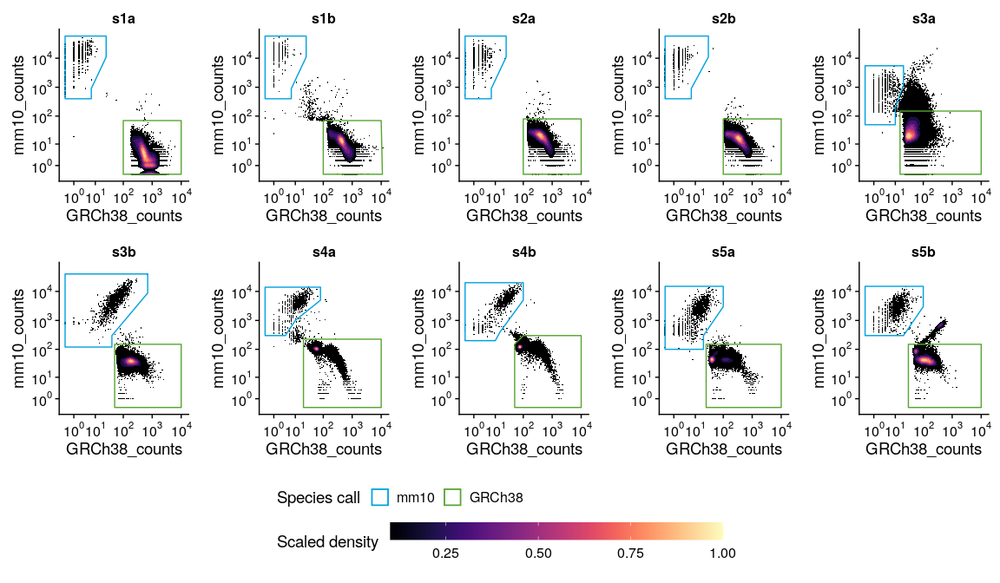
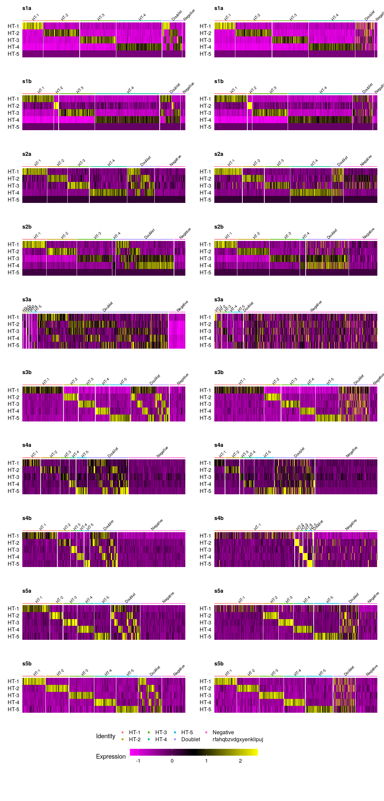
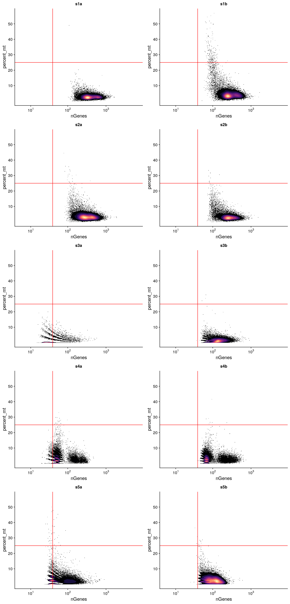
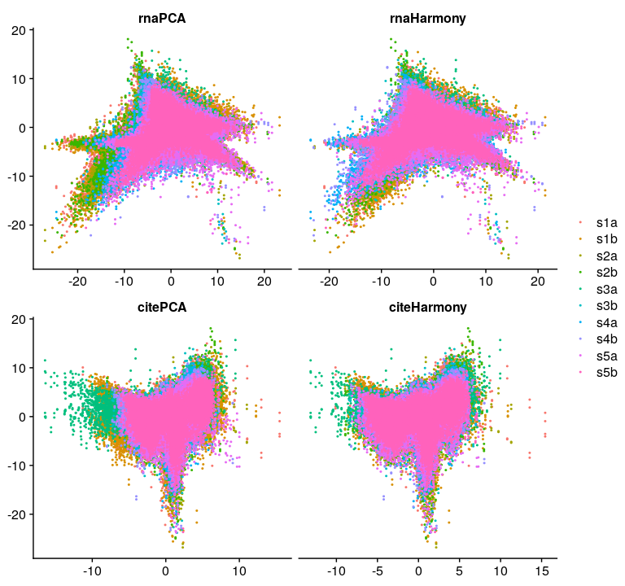
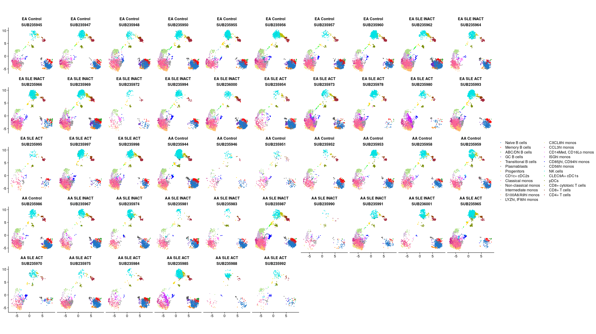
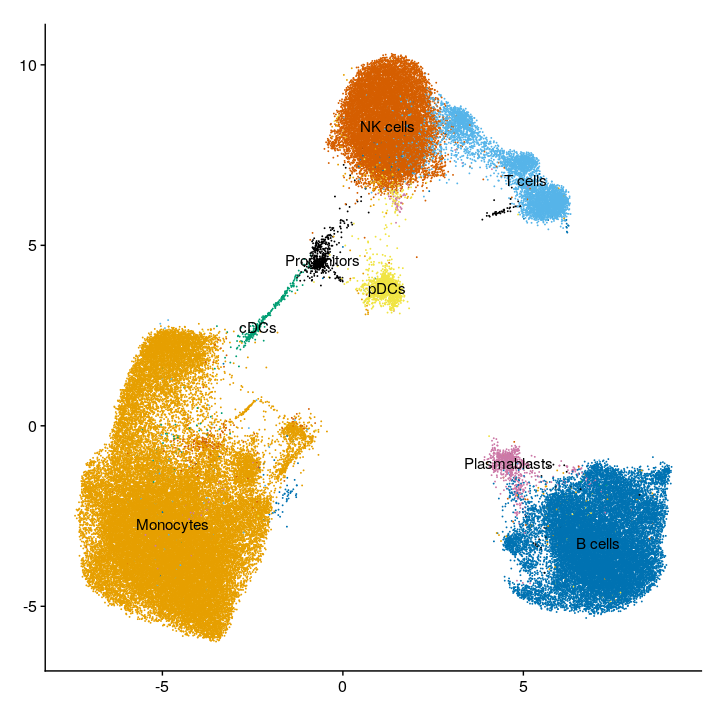
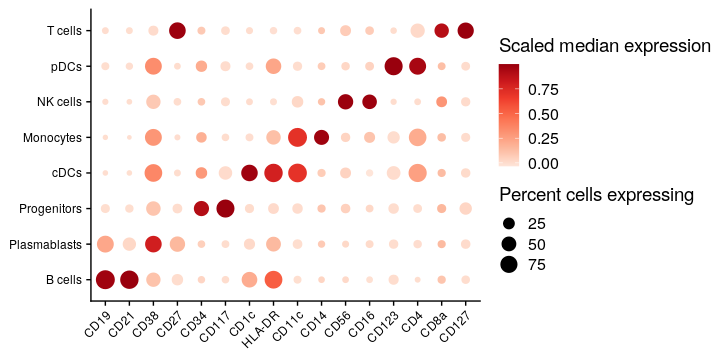
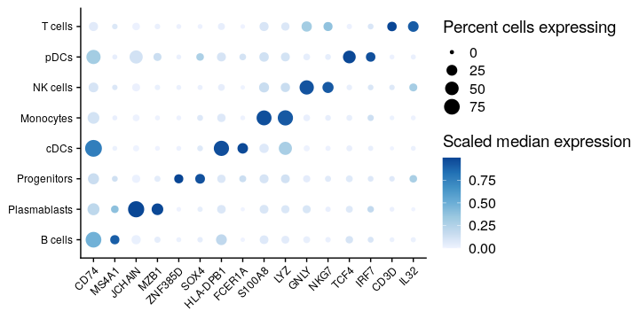
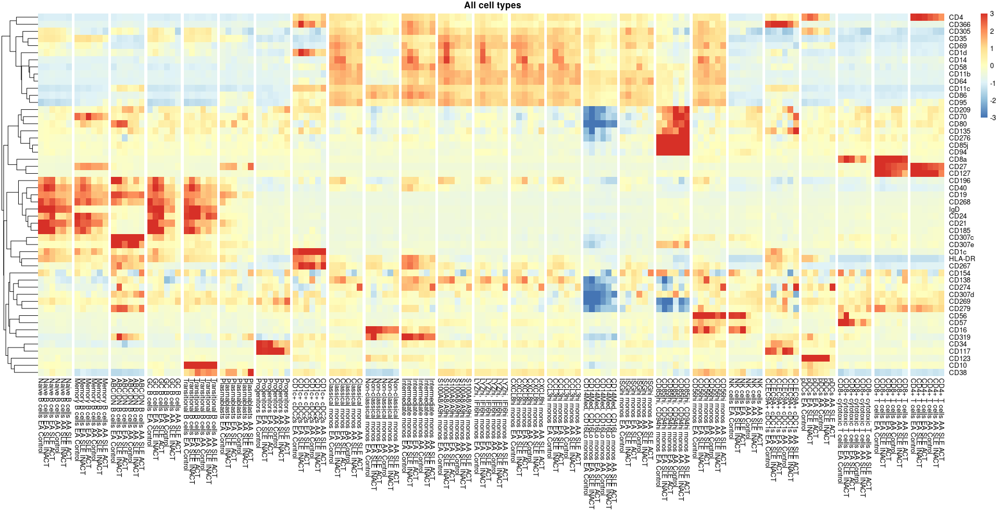

Supplemental Figures
================
Kevin Thomas
13 January, 2022

-   [S10A](#s10a)
    -   [Setting graphical cutoffs](#setting-graphical-cutoffs)
    -   [Plotting](#plotting)
-   [S10B](#s10b)
-   [S10C](#s10c)
-   [S11A-B](#s11a-b)
-   [S12](#s12)
-   [S13A](#s13a)
-   [S13B](#s13b)
-   [S13C](#s13c)
-   [S14](#s14)

## S10A

### Setting graphical cutoffs

``` r
# Set mouse cutoffs
mouse_cutoffs <- list(
  s1a = data.frame(
    x = c(0, 0, 25, 25, 7, 7),
    y = c(400, 58100, 58100, 11000, 900, 400)
  ),
  s1b = data.frame(
    x = c(0, 0, 25, 25, 7, 7),
    y = c(400, 58100, 58100, 11000, 900, 400)
  ),
  s2a = data.frame(
    x = c(0, 0, 25, 25, 7, 7),
    y = c(400, 58100, 58100, 11000, 900, 400)
  ),
  s2b = data.frame(
    x = c(0, 0, 30, 30, 7, 7),
    y = c(400, 58100, 58100, 11000, 900, 400)
  ),
  s3a = data.frame(
    x = c(0, 0, 20, 20, 10, 10),
    y = c(50, 5500, 5500, 1200, 200, 50)
  ),
  s3b = data.frame(
    x = c(0, 0, 700, 700, 40, 40),
    y = c(120, 40000, 40000, 8800, 300, 120)
  ),
  s4a = data.frame(
    x = c(0, 0, 80, 80, 10, 4),
    y = c(300, 14000, 14000, 5000, 1000, 300)
  ),
  s4b = data.frame(
    x = c(0, 0, 100, 100, 15, 10),
    y = c(200, 20000, 20000, 5000, 400, 200)
  ),
  s5a = data.frame(
    x = c(0, 0, 100, 100, 20, 20),
    y = c(100, 15000, 15000, 3000, 300, 100)
  ),
  s5b = data.frame(
    x = c(0, 0, 100, 100, 20),
    y = c(300, 15000, 15000, 3000, 300)
  )
) %>%
  bind_rows(.id = "run")

# Set human cutoffs
human_cutoffs <- list(
  s1a = data.frame(
    x = c(100, 10000, 10000, 100),
    y = c(70, 70, 0, 0)
  ),
  s1b = data.frame(
    x = c(100, 10000, 11000, 100),
    y = c(70, 70, 0, 0)
  ),
  s2a = data.frame(
    x = c(100, 10000, 10000, 100),
    y = c(80, 80, 0, 0)
  ),
  s2b = data.frame(
    x = c(100, 10000, 10000, 100),
    y = c(80, 80, 0, 0)
  ),
  s3a = data.frame(
    x = c(15, 10000, 10000, 15),
    y = c(150, 150, 0, 0)
  ),
  s3b = data.frame(
    x = c(50, 10000, 10000, 50),
    y = c(150, 150, 0, 0)
  ),
  s4a = data.frame(
    x = c(20, 10000, 10000, 20),
    y = c(225, 225, 0, 0)
  ),
  s4b = data.frame(
    x = c(50, 100, 10000, 10000, 50),
    y = c(150, 300, 300, 0, 0)
  ),
  s5a = data.frame(
    x = c(25, 10000, 10000, 25),
    y = c(150, 150, 0, 0)
  ),
  s5b = data.frame(
    x = c(30, 10000, 10000, 30),
    y = c(150, 150, 0, 0)
  )
) %>%
  bind_rows(.id = "run")
```

### Plotting

``` r
plots <- map(
  .x = unique(gem_classification$run),
  .f = function(r) {
    df <- gem_classification %>%
      filter(run == r)
    mc <- mouse_cutoffs %>%
      filter(run == r)
    hc <- human_cutoffs %>%
      filter(run == r)
    cutoffs <- bind_rows(
      `names<-`(
        x = list(mc, hc),
        value = c(str_remove_all(secondary_species_prefix, "_"), str_remove_all(primary_species_prefix, "_"))
      ),
      .id = "Species"
    )
    
    gg <- ggplot(
      data = df,
      mapping = aes(
        x = eval(parse(text=paste0("`", str_remove_all(primary_species_prefix, "_"), "_counts`"))),
        y = eval(parse(text=paste0("`", str_remove_all(secondary_species_prefix, "_"), "_counts`"))),
      )
    ) +
    geom_point(
      size = 0.2,
      shape = 16,
    ) +
    stat_density_2d(aes(fill = ..level..), geom = "polygon", contour_var = "ndensity") +
    scale_fill_viridis(option = "magma") +
    geom_polygon(aes(x, y, group = Species, color = Species), data = cutoffs, fill = NA) +
    scale_color_manual(
      values = `names<-`(
        x = c("#00a1df", "#58a532"),
        value = c(str_remove_all(secondary_species_prefix, "_"), str_remove_all(primary_species_prefix, "_"))
      ),
      guide = guide_legend(title = "Species call", override.aes = list(alpha = 0))
    ) +
    scale_x_continuous(
      trans = log10p,
      breaks = map_int(0:4, ~int(10^.x)),
      labels = scales::trans_format("log10", scales::math_format(10^.x)),
      limits = c(
        min(
          c(
            eval(parse(text=paste0("gem_classification$", str_remove_all(primary_species_prefix, "_"), "_counts"))),
            human_cutoffs$x
          )
        ),
        max(
          c(
            eval(parse(text=paste0("gem_classification$", str_remove_all(primary_species_prefix, "_"), "_counts"))),
            human_cutoffs$x
          )
        )
      )
    ) +
    scale_y_continuous(
      trans = log10p,
      breaks = map_int(0:4, ~int(10^.x)),
      labels = scales::trans_format("log10", scales::math_format(10^.x)),
      limits = c(
        min(
          c(
            eval(parse(text=paste0("gem_classification$", str_remove_all(secondary_species_prefix, "_"), "_counts"))),
            mouse_cutoffs$y
          )
        ),
        max(
          c(
            eval(parse(text=paste0("gem_classification$", str_remove_all(secondary_species_prefix, "_"), "_counts"))),
            mouse_cutoffs$y
          )
        )
      )
    ) +
    facet_wrap(~run) +
    labs(
      x = paste0(str_remove_all(primary_species_prefix, "_"), "_counts"),
      y = paste0(str_remove_all(secondary_species_prefix, "_"), "_counts"),
      fill = "Scaled density"
    ) +
    theme(
      legend.position = "hidden",
      strip.background = element_blank(),
      strip.text = element_text(face = "bold"),
    ) +
    coord_fixed()
    
    return (gg)
  }
)

legend <- get_legend(plots[[1]] + theme(legend.position = c(0.5,0.5), legend.direction = "horizontal", legend.justification = "center") + guides(fill = guide_colorbar(barwidth = 20)))

plot_grid(
  plots[[1]],
  plots[[2]],
  plots[[3]],
  plots[[4]],
  plots[[5]],
  plots[[6]],
  plots[[7]],
  plots[[8]],
  plots[[9]],
  plots[[10]],
  NULL,
  NULL,
  legend,
  ncol = 5,
  rel_heights = c(1,1,0.5)
)
```

<!-- -->

## S10B

``` r
# Make heatmaps showing assignments by HTODemux (Seurat)
heatmaps1 <- map(
  .x = str_sort(unique(pre_qc$run)),
  .f = function (i) {
    # Subset pre_qc object and scale the HTO data
    object <- subset(
        x = pre_qc,
        cells = gem_classification[
          which(x = gem_classification$call == str_remove_all(primary_species_prefix, "_") & gem_classification$run == i),
        ] %>%
          (function(x) paste0(x$run, "_", x$cells))
    ) %>%
      subset(x = ., cells = sample(x = colnames(x = .), size = 5000)) %>%
      ScaleData(object = ., assay = "HTO", verbose = FALSE)
    
    # Define singlets and doublets
    singlets <- which(x = object$HTO_classification.global == "Singlet")
    doublets <- which(x = object$HTO_classification.global == "Doublet")
    
    # Set levels for the HTO classification and hash IDs
    object$HTO_classification.global <- factor(
      x = object$HTO_classification,
      levels = c(
        sort(unique(object$HTO_classification[singlets])),
        sort(unique(object$HTO_classification[doublets])),
        "Negative"
      )
    )
    object$hash.ID <- factor(
      x = object$hash.ID,
      levels = c(
        sort(unique(object$HTO_classification[singlets])),
        "Doublet",
        "Negative"
      )
    )
    
    # Putting hash groups in correct order
    plot.order <- factor(
      x = object$HTO_classification,
      levels = c(
        sort(unique(object$HTO_classification[singlets])),
        sort(unique(object$HTO_classification[doublets])),
        "Negative"
      )
    ) %>%
      sort() %>%
      names()
    
    # Make the plot
    gg <- DoHeatmap(
      object = object,
      assay = "HTO",
      features = rownames(object[["HTO"]]),
      cells = plot.order,
      group.by = "hash.ID",
      group.bar = TRUE,
      group.colors = gg_color_hue(n = 7)[c(1:length(unique(object$hash.ID[singlets])),6:7)],
      disp.min = -2.5,
      disp.max = 2.5,
      size = 3
    ) +
      labs(title = i) +
      theme(
        plot.title = element_text(size = 12),
        legend.position = "hidden"
      )
    return(gg)
  }
)

# Make heatmaps showing assignments by DeMULTIplex
heatmaps2 <- map(
  .x = str_sort(unique(pre_qc$run)),
  .f = function (i) {
    # Subset pre_qc object and scale the HTO data
    object <- subset(
        x = pre_qc,
        cells = gem_classification[
          which(x = gem_classification$call == str_remove_all(primary_species_prefix, "_") & gem_classification$run == i),
        ] %>%
          (function(x) paste0(x$run, "_", x$cells))
    ) %>%
      subset(x = ., cells = sample(x = colnames(x = .), size = 5000)) %>%
      ScaleData(object = ., assay = "HTO", verbose = FALSE)
    
    # Define singlets and doublets
    singlets <- which(x = object$deMULTIplex.calls.rescued %nin% c("Negative", "Doublet"))
    doublets <- which(x = object$deMULTIplex.calls.rescued == "Doublet")
    
    # Set levels for the HTO classification and hash IDs
    object$deMULTIplex.calls.rescued <- factor(
      x = object$deMULTIplex.calls.rescued,
      levels = c(
        sort(unique(object$deMULTIplex.calls.rescued)[unique(object$deMULTIplex.calls.rescued) %nin% c("Negative", "Doublet")]),
        "Doublet",
        "Negative"
      )
    )
    
    # Make the plot
    gg <- DoHeatmap(
      object = object,
      assay = "HTO",
      features = rownames(object[["HTO"]]),
      group.by = "deMULTIplex.calls.rescued",
      group.bar = TRUE,
      group.colors = gg_color_hue(n = 7)[c(1:length(unique(object$deMULTIplex.calls.rescued[singlets])),6:7)],
      disp.min = -2.5,
      disp.max = 2.5,
      size = 3
    ) +
      labs(title = i) +
      theme(
        plot.title = element_text(size = 12),
        legend.position = "hidden"
      )
    return(gg)
  }
)

# Make a common legend
legend <- get_legend(heatmaps1[[10]] + theme(legend.position = c(0.5,0.75), legend.direction = "horizontal") + guides(fill = guide_colorbar(barwidth = 20)))

# Plot grid
plot_grid(
  heatmaps1[[1]],
  heatmaps2[[1]],
  heatmaps1[[2]],
  heatmaps2[[2]],
  heatmaps1[[3]],
  heatmaps2[[3]],
  heatmaps1[[4]],
  heatmaps2[[4]],
  heatmaps1[[5]],
  heatmaps2[[5]],
  heatmaps1[[6]],
  heatmaps2[[6]],
  heatmaps1[[7]],
  heatmaps2[[7]],
  heatmaps1[[8]],
  heatmaps2[[8]],
  heatmaps1[[9]],
  heatmaps2[[9]],
  heatmaps1[[10]],
  heatmaps2[[10]],
  legend,
  ncol = 2)
```

<!-- -->

## S10C

``` r
map(
  .x = str_sort(unique(pre_qc$run)),
  .f = function(i) {
    # Subset object by run
    obj <- pre_qc %>%
      subset(
        cells = gem_classification[
          which(x = gem_classification$call == str_remove_all(primary_species_prefix, "_") & gem_classification$run == i),
        ] %>%
          (function(x) paste0(x$run, "_", x$cells))
      ) %>%
      PurgeXenoGenes(
        object = .,
        primary_species_prefix = str_replace_all(primary_species_prefix, "_", "-"),
        secondary_species_prefix = str_replace_all(secondary_species_prefix, "_", "-")
      ) %>%
      # Only singlets
      subset(`final.HTO.ID` %nin% c("Doublet", "Negative")) %>%
      # Percent mito and hemoglobin
      PercentageFeatureSet(
        object = .,
        pattern = "^MT-",
        col.name = "percent_mt"
      ) %>%
      PercentageFeatureSet(
        object = .,
        pattern = "^HB[ABDEGMQZ].?$",
        col.name = "percent_hemo"
      )
    
    # Make plots
    gg <- FetchData(
      object = obj,
      vars = c("nFeature_RNA", "percent_mt", "percent_hemo", "nCount_RNA")
    ) %>%
      dplyr::rename(nGenes = nFeature_RNA) %>%
      # as.data.frame() %>%
      ggplot(data = ., aes(x = nGenes, y = percent_mt)) +
      geom_point(size = 0.2, shape = 16, show.legend = FALSE) +
      stat_density_2d(aes(fill = ..level..), geom = "polygon", contour_var = "density", show.legend = FALSE) +
      scale_fill_viridis(option = "magma") +
      geom_hline(yintercept = 25, col = "red") +
      geom_vline(xintercept = 40, col = "red") +
      scale_x_continuous(
        trans = log10p,
        breaks = map_int(0:5, ~int(10^.x)),
        labels = scales::trans_format("log10", scales::math_format(10^.x)),
        limits = c(min(pre_qc$nFeature_RNA), max(pre_qc$nFeature_RNA))
      ) +
      scale_y_continuous(limits = c(0,57), breaks = c(10,20,30,40,50)) +
      labs(title = i) +
      theme(
        plot.title = element_text(hjust = 0.5, size = 12)
      )
    return(gg)
  }
) %>% plot_grid(plotlist = ., ncol = 2)
```

    ## Warning: Adding a command log without an assay associated with it

    ## Warning: Adding a command log without an assay associated with it

    ## Warning: Adding a command log without an assay associated with it

    ## Warning: Adding a command log without an assay associated with it

    ## Warning: Adding a command log without an assay associated with it

    ## Warning: Adding a command log without an assay associated with it

    ## Warning: Adding a command log without an assay associated with it

    ## Warning: Adding a command log without an assay associated with it

    ## Warning: Adding a command log without an assay associated with it

    ## Warning: Adding a command log without an assay associated with it

<!-- -->

## S11A-B

``` r
# PCA dimensions with and without Harmony correction for batch
FetchData(
  object = sc,
  vars = c(
    "run",
    paste0(c(rep("PC_",2), rep("harmony_",2), rep("citePCA_",2), rep("harmonycite_",2)), rep(1:2, 4))
  )
) %>%
  pivot_longer(
    cols = paste0(c("PC_", "harmony_", "citePCA_", "harmonycite_"), 1),
    names_to = "dim1",
    values_to = "value1"
  ) %>%
  pivot_longer(
    cols = paste0(c("PC_", "harmony_", "citePCA_", "harmonycite_"), 2),
    names_to = "dim2",
    values_to = "value2"
  ) %>%
  mutate(
    reduction = str_extract(dim1, "[^_]*") %>%
      factor(levels = c("PC", "harmony", "citePCA", "harmonycite")) %>%
      fct_recode(rnaPCA = "PC", rnaHarmony = "harmony", citePCA = "citePCA", citeHarmony = "harmonycite")
  ) %>%
  ggplot(aes(x = value1, y = value2, col = run)) +
  geom_point(size = 0.4) +
  facet_wrap(~reduction, scales = "free_x") +
  cowplot::theme_cowplot() +
  theme(strip.background = element_blank(), strip.text = element_text(face = "bold")) +
  labs(x = NULL, y = NULL, col = NULL)
```

<!-- -->

## S12

``` r
# Plot UMAP reductions for each patient
FetchData(
  object = sc,
  vars = c("ancestry", "classification", "clusters_annotated", "subject_id", "wnnUMAP_1", "wnnUMAP_2")
) %>%
  mutate(
    group = paste0(ancestry, " ", classification) %>%
      factor(levels = c("EA Control", "EA SLE INACT", "EA SLE ACT", "AA Control", "AA SLE INACT", "AA SLE ACT"))
  ) %>%
  ggplot(aes(x = wnnUMAP_1, y = wnnUMAP_2, col = clusters_annotated)) +
  geom_point(size = 0.4) +
  scale_color_manual(
    values = `names<-`(pals::cols25(n = length(levels(sc$clusters_annotated))), levels(sc$clusters_annotated))
  ) +
  facet_wrap(~group + subject_id, nrow = 5) +
  labs(x = NULL, y = NULL, col = NULL) +
  theme(
    panel.background = element_blank(),
    strip.background = element_blank(),
    strip.text = element_text(face = "bold"),
    legend.key = element_blank()
  ) +
  coord_fixed()
```

<!-- -->

## S13A

``` r
# Plot total UMAP of object after QC
DimPlot(
  object = sc,
  reduction = "umap_wnn",
  dims = c(1,2),
  group.by = "coarse_cell_type",
  cols = `names<-`(pals::okabe(n = length(levels(sc$coarse_cell_type))), unique(sc$coarse_cell_type)),
  label = TRUE,
  label.size = 4
) +
  labs(title = NULL, x = NULL, y = NULL) + 
  NoLegend() +
  coord_fixed()
```

<!-- -->

## S13B

``` r
# CITE markers of coarse cell types
coarse_markers_cite <- c("CD19", "CD21", "CD38", "CD27", "CD34", "CD117", "CD1c", "HLA-DR", "CD11c", "CD14", "CD56", "CD16", "CD123", "CD4", "CD8a", "CD127")

# Bubbleplot
bubbleplot(
  object = sc,
  assay = "CITE",
  slot = "data",
  features_plot = coarse_markers_cite,
  preserve_feature_order = TRUE,
  grouping_var = "coarse_cell_type",
  filter_exp_pct_thresh = 1,
  avg_func = "median",
  do_return = TRUE
) +
  scale_size_continuous() +
  scale_color_distiller(palette = "Reds", direction = 1) +
  labs(title = NULL, x = NULL, y = NULL, col = "Scaled median expression", size = "Percent cells expressing") +
  theme(axis.text.x = element_text(angle = 45, hjust = 1, vjust = 1))
```

    ## Scale for 'size' is already present. Adding another scale for 'size', which will replace the existing scale.

    ## Scale for 'colour' is already present. Adding another scale for 'colour', which will replace the existing scale.

<!-- -->

## S13C

``` r
# Gene markers of coarse cell types
coarse_markers_genes <- c("CD74", "MS4A1", "JCHAIN", "MZB1", "ZNF385D", "SOX4", "HLA-DPB1", "FCER1A", "S100A8", "LYZ", "GNLY", "NKG7", "TCF4", "IRF7", "CD3D", "IL32")

bubbleplot(
  object = sc,
  assay = "SCT",
  slot = "data",
  features_plot = coarse_markers_genes,
  preserve_feature_order = TRUE,
  cluster_x = FALSE,
  grouping_var = "coarse_cell_type",
  filter_exp_pct_thresh = 0,
  avg_func = "mean",
  do_return = TRUE
) +
  scale_size_continuous() +
  scale_color_distiller(palette = "Blues", direction = 1) +
  labs(title = NULL, x = NULL, y = NULL, col = "Scaled median expression", size = "Percent cells expressing") +
  theme(axis.text.x = element_text(angle = 45, hjust = 1, vjust = 1))
```

    ## Scale for 'size' is already present. Adding another scale for 'size', which will replace the existing scale.

    ## Scale for 'colour' is already present. Adding another scale for 'colour', which will replace the existing scale.

<!-- -->

## S14

``` r
# Global CITEseq heatmap
## Fetch data for all values and turn into matrix
mat <- FetchData(
  object = `DefaultAssay<-`(sc, value = "CITE"),
  vars = c("classification", "ancestry", "clusters_annotated", rownames(sc[["CITE"]])[rownames(sc[["CITE"]]) != "isotype-control"])
) %>%
  as_tibble(rownames = "cell") %>%
  group_by(
    ident = factor(
      x = paste0(get("clusters_annotated"), " ", get("ancestry"), " ", get("classification")),
      levels = expand.grid(
        c("EA Control", "EA SLE INACT", "EA SLE ACT", "AA Control", "AA SLE INACT", "AA SLE ACT"),
        levels(get("clusters_annotated"))
      ) %>%
        (function (x) {paste0(x$Var2, " ", x$Var1)})
    )
  ) %>%
  summarize_if(is.numeric, median) %>%
  as.data.frame() %>%
  column_to_rownames("ident") %>%
  t()

pheatmap::pheatmap(
  mat = mat,
  breaks = seq.int(-3,3,length.out = 100),
  scale = "row",
  cluster_col = F,
  # treeheight_row = 0,
  gaps_col = (1:ncol(mat))[(1:ncol(mat) %% 6) == 0],
  main = "All cell types"
)
```

<!-- -->

``` r
devtools::session_info()
```

    ## ─ Session info ───────────────────────────────────────────────────────────────────────────────────────────────────────────────────────────────────────────────────────────────────────────────────────────────────────────────────────────────────────────────────────────────────────────────────────────────────────────────────────────────────────────────────────────────────────────────────────────────────────────────────────────────────────────────────────────────────────────────────────────────────────────────────────────────────────────────────────────────────────────────────────────────────────────────────────────────────────────────────────────────────────────────────────────────────────────────────────────────────────────────────────────────────────────────────────────────────────────────────────────────────────────────────────────────────────────────────────────────────────────────────────────────────────────────────────────────────────────────────────────────────────────────────────────────────────────────────────────────────────────────────────────────────────────────────────────────────────────────────────────────────────────────────────────────────────────────────────────────
    ##  setting  value                       
    ##  version  R version 4.1.0 (2021-05-18)
    ##  os       Ubuntu 20.04.2 LTS          
    ##  system   x86_64, linux-gnu           
    ##  ui       X11                         
    ##  language (EN)                        
    ##  collate  en_US.UTF-8                 
    ##  ctype    en_US.UTF-8                 
    ##  tz       Etc/UTC                     
    ##  date     2022-01-13                  
    ## 
    ## ─ Packages ───────────────────────────────────────────────────────────────────────────────────────────────────────────────────────────────────────────────────────────────────────────────────────────────────────────────────────────────────────────────────────────────────────────────────────────────────────────────────────────────────────────────────────────────────────────────────────────────────────────────────────────────────────────────────────────────────────────────────────────────────────────────────────────────────────────────────────────────────────────────────────────────────────────────────────────────────────────────────────────────────────────────────────────────────────────────────────────────────────────────────────────────────────────────────────────────────────────────────────────────────────────────────────────────────────────────────────────────────────────────────────────────────────────────────────────────────────────────────────────────────────────────────────────────────────────────────────────────────────────────────────────────────────────────────────────────────────────────────────────────────────────────────────────────────────────────────────────────────
    ##  package              * version    date       lib source                                        
    ##  abind                  1.4-5      2016-07-21 [1] RSPM (R 4.1.0)                                
    ##  AnnotationDbi          1.54.1     2021-06-08 [1] RSPM (R 4.1.0)                                
    ##  assertthat             0.2.1      2019-03-21 [1] RSPM (R 4.1.0)                                
    ##  backports              1.2.1      2020-12-09 [1] RSPM (R 4.1.0)                                
    ##  base64url              1.4        2018-05-14 [1] RSPM (R 4.1.0)                                
    ##  bayesm                 3.1-4      2019-10-15 [1] RSPM (R 4.1.0)                                
    ##  beachmat               2.8.0      2021-05-19 [1] Bioconductor                                  
    ##  beeswarm               0.4.0      2021-06-01 [1] RSPM (R 4.1.0)                                
    ##  Biobase              * 2.52.0     2021-05-19 [1] RSPM (R 4.1.0)                                
    ##  BiocGenerics         * 0.38.0     2021-08-13 [1] bioc_git2r (@1db849a)                         
    ##  BiocManager          * 1.30.16    2021-06-15 [1] CRAN (R 4.1.0)                                
    ##  BiocNeighbors        * 1.10.0     2021-05-19 [1] RSPM (R 4.1.0)                                
    ##  BiocParallel         * 1.26.1     2021-07-04 [1] RSPM (R 4.1.0)                                
    ##  BiocSingular           1.8.1      2021-06-08 [1] Bioconductor                                  
    ##  Biostrings             2.60.2     2021-08-05 [1] Bioconductor                                  
    ##  bit                    4.0.4      2020-08-04 [1] RSPM (R 4.1.0)                                
    ##  bit64                  4.0.5      2020-08-30 [1] RSPM (R 4.1.0)                                
    ##  bitops                 1.0-7      2021-04-24 [1] RSPM (R 4.1.0)                                
    ##  blob                   1.2.2      2021-07-23 [1] RSPM (R 4.1.0)                                
    ##  broom                  0.7.9      2021-07-27 [1] RSPM (R 4.1.0)                                
    ##  cachem                 1.0.5      2021-05-15 [1] RSPM (R 4.1.0)                                
    ##  callr                  3.7.0      2021-04-20 [1] RSPM (R 4.1.0)                                
    ##  car                    3.0-11     2021-06-27 [1] RSPM (R 4.1.0)                                
    ##  carData                3.0-4      2020-05-22 [1] RSPM (R 4.1.0)                                
    ##  cellranger             1.1.0      2016-07-27 [1] RSPM (R 4.1.0)                                
    ##  cli                    3.0.1      2021-07-17 [1] RSPM (R 4.1.0)                                
    ##  cluster                2.1.2      2021-04-17 [2] CRAN (R 4.1.0)                                
    ##  codetools              0.2-18     2020-11-04 [2] CRAN (R 4.1.0)                                
    ##  colorspace             2.0-2      2021-06-24 [1] RSPM (R 4.1.0)                                
    ##  compositions           2.0-2      2021-07-14 [1] RSPM (R 4.1.0)                                
    ##  cowplot              * 1.1.1      2020-12-30 [1] RSPM (R 4.1.0)                                
    ##  crayon                 1.4.1      2021-02-08 [1] RSPM (R 4.1.0)                                
    ##  curl                   4.3.2      2021-06-23 [1] RSPM (R 4.1.0)                                
    ##  data.table           * 1.14.0     2021-02-21 [1] RSPM (R 4.1.0)                                
    ##  DBI                    1.1.1      2021-01-15 [1] RSPM (R 4.1.0)                                
    ##  dbplyr                 2.1.1      2021-04-06 [1] RSPM (R 4.1.0)                                
    ##  DelayedArray           0.18.0     2021-05-19 [1] RSPM (R 4.1.0)                                
    ##  DelayedMatrixStats     1.14.2     2021-08-08 [1] Bioconductor                                  
    ##  deldir                 0.2-10     2021-02-16 [1] RSPM (R 4.1.0)                                
    ##  deMULTIplex          * 1.0.2      2021-08-13 [1] Github (chris-mcginnis-ucsf/MULTI-seq@6e2a142)
    ##  DEoptimR               1.0-9      2021-05-24 [1] RSPM (R 4.1.0)                                
    ##  desc                   1.3.0      2021-03-05 [1] RSPM (R 4.1.0)                                
    ##  devtools               2.4.2      2021-06-07 [1] RSPM (R 4.1.0)                                
    ##  dichromat              2.0-0      2013-01-24 [1] RSPM (R 4.1.0)                                
    ##  digest                 0.6.27     2020-10-24 [1] RSPM (R 4.1.0)                                
    ##  dplyr                * 1.0.7      2021-06-18 [1] RSPM (R 4.1.0)                                
    ##  drake                * 7.13.2     2021-04-22 [1] RSPM (R 4.1.0)                                
    ##  dsb                  * 0.2.0      2021-08-13 [1] Github (niaid/dsb@768691f)                    
    ##  ellipsis               0.3.2      2021-04-29 [1] RSPM (R 4.1.0)                                
    ##  evaluate               0.14       2019-05-28 [1] RSPM (R 4.1.0)                                
    ##  fansi                  0.5.0      2021-05-25 [1] RSPM (R 4.1.0)                                
    ##  farver                 2.1.0      2021-02-28 [1] RSPM (R 4.1.0)                                
    ##  fastmap                1.1.0      2021-01-25 [1] RSPM (R 4.1.0)                                
    ##  filelock               1.0.2      2018-10-05 [1] RSPM (R 4.1.0)                                
    ##  fitdistrplus           1.1-5      2021-05-28 [1] RSPM (R 4.1.0)                                
    ##  forcats              * 0.5.1      2021-01-27 [1] RSPM (R 4.1.0)                                
    ##  foreign                0.8-81     2020-12-22 [2] CRAN (R 4.1.0)                                
    ##  formattable          * 0.2.1      2021-01-07 [1] RSPM (R 4.1.0)                                
    ##  fs                     1.5.0      2020-07-31 [1] RSPM (R 4.1.0)                                
    ##  furrr                * 0.2.3      2021-06-25 [1] RSPM (R 4.1.0)                                
    ##  future               * 1.21.0     2020-12-10 [1] RSPM (R 4.1.0)                                
    ##  future.apply           1.7.0      2021-01-04 [1] RSPM (R 4.1.0)                                
    ##  future.callr         * 0.6.1      2021-05-04 [1] RSPM (R 4.1.0)                                
    ##  generics               0.1.0      2020-10-31 [1] RSPM (R 4.1.0)                                
    ##  GenomeInfoDb         * 1.28.1     2021-07-01 [1] RSPM (R 4.1.0)                                
    ##  GenomeInfoDbData       1.2.6      2021-08-04 [1] RSPM (R 4.1.0)                                
    ##  GenomicRanges        * 1.44.0     2021-05-19 [1] RSPM (R 4.1.0)                                
    ##  ggbeeswarm             0.6.0      2017-08-07 [1] RSPM (R 4.1.0)                                
    ##  ggforce              * 0.3.3      2021-03-05 [1] RSPM (R 4.1.0)                                
    ##  ggplot2              * 3.3.5      2021-06-25 [1] RSPM (R 4.1.0)                                
    ##  ggpubr                 0.4.0      2020-06-27 [1] RSPM (R 4.1.0)                                
    ##  ggrepel              * 0.9.1      2021-01-15 [1] RSPM (R 4.1.0)                                
    ##  ggridges               0.5.3      2021-01-08 [1] RSPM (R 4.1.0)                                
    ##  ggsignif               0.6.2      2021-06-14 [1] RSPM (R 4.1.0)                                
    ##  globals                0.14.0     2020-11-22 [1] RSPM (R 4.1.0)                                
    ##  glue                 * 1.4.2      2020-08-27 [1] RSPM (R 4.1.0)                                
    ##  goftest                1.2-2      2019-12-02 [1] RSPM (R 4.1.0)                                
    ##  gridExtra              2.3        2017-09-09 [1] RSPM (R 4.1.0)                                
    ##  gtable                 0.3.0      2019-03-25 [1] RSPM (R 4.1.0)                                
    ##  gtools                 3.9.2      2021-06-06 [1] RSPM (R 4.1.0)                                
    ##  harmony              * 0.1.0      2021-08-13 [1] Github (immunogenomics/harmony@c93de54)       
    ##  haven                  2.4.3      2021-08-04 [1] RSPM (R 4.1.0)                                
    ##  HGNChelper             0.8.1      2019-10-24 [1] RSPM (R 4.1.0)                                
    ##  highr                  0.9        2021-04-16 [1] RSPM (R 4.1.0)                                
    ##  hms                    1.1.0      2021-05-17 [1] RSPM (R 4.1.0)                                
    ##  htmltools              0.5.1.1    2021-01-22 [1] RSPM (R 4.1.0)                                
    ##  htmlwidgets            1.5.3      2020-12-10 [1] RSPM (R 4.1.0)                                
    ##  httpuv                 1.6.1      2021-05-07 [1] RSPM (R 4.1.0)                                
    ##  httr                   1.4.2      2020-07-20 [1] RSPM (R 4.1.0)                                
    ##  ica                    1.0-2      2018-05-24 [1] RSPM (R 4.1.0)                                
    ##  igraph                 1.2.6      2020-10-06 [1] RSPM (R 4.1.0)                                
    ##  IRanges              * 2.26.0     2021-05-19 [1] RSPM (R 4.1.0)                                
    ##  irlba                  2.3.3      2019-02-05 [1] RSPM (R 4.1.0)                                
    ##  isoband                0.2.5      2021-07-13 [1] RSPM (R 4.1.0)                                
    ##  janitor              * 2.1.0      2021-01-05 [1] RSPM (R 4.1.0)                                
    ##  jsonlite               1.7.2      2020-12-09 [1] RSPM (R 4.1.0)                                
    ##  kableExtra           * 1.3.4      2021-02-20 [1] RSPM (R 4.1.0)                                
    ##  KEGGREST               1.32.0     2021-05-19 [1] RSPM (R 4.1.0)                                
    ##  KernSmooth             2.23-20    2021-05-03 [2] CRAN (R 4.1.0)                                
    ##  knitr                  1.33       2021-04-24 [1] RSPM (R 4.1.0)                                
    ##  labeling               0.4.2      2020-10-20 [1] RSPM (R 4.1.0)                                
    ##  later                  1.2.0      2021-04-23 [1] RSPM (R 4.1.0)                                
    ##  lattice                0.20-44    2021-05-02 [2] CRAN (R 4.1.0)                                
    ##  lazyeval               0.2.2      2019-03-15 [1] RSPM (R 4.1.0)                                
    ##  leiden                 0.3.9      2021-07-27 [1] RSPM (R 4.1.0)                                
    ##  lifecycle              1.0.0      2021-02-15 [1] RSPM (R 4.1.0)                                
    ##  limma                  3.48.3     2021-08-10 [1] Bioconductor                                  
    ##  listenv                0.8.0      2019-12-05 [1] RSPM (R 4.1.0)                                
    ##  lmtest                 0.9-38     2020-09-09 [1] RSPM (R 4.1.0)                                
    ##  lubridate            * 1.7.10     2021-02-26 [1] RSPM (R 4.1.0)                                
    ##  magrittr             * 2.0.1      2020-11-17 [1] RSPM (R 4.1.0)                                
    ##  mapproj                1.2.7      2020-02-03 [1] RSPM (R 4.1.0)                                
    ##  maps                   3.4.0      2021-09-25 [1] RSPM (R 4.1.0)                                
    ##  MASS                   7.3-54     2021-05-03 [2] CRAN (R 4.1.0)                                
    ##  Matrix               * 1.3-4      2021-06-01 [2] RSPM (R 4.1.0)                                
    ##  MatrixGenerics       * 1.4.2      2021-08-08 [1] Bioconductor                                  
    ##  matrixStats          * 0.60.0     2021-07-26 [1] RSPM (R 4.1.0)                                
    ##  mclust                 5.4.7      2020-11-20 [1] RSPM (R 4.1.0)                                
    ##  memoise                2.0.0      2021-01-26 [1] RSPM (R 4.1.0)                                
    ##  mgcv                   1.8-36     2021-06-01 [2] RSPM (R 4.1.0)                                
    ##  mime                   0.11       2021-06-23 [1] RSPM (R 4.1.0)                                
    ##  miniUI                 0.1.1.1    2018-05-18 [1] RSPM (R 4.1.0)                                
    ##  modelr                 0.1.8      2020-05-19 [1] RSPM (R 4.1.0)                                
    ##  munsell                0.5.0      2018-06-12 [1] RSPM (R 4.1.0)                                
    ##  nlme                   3.1-152    2021-02-04 [2] CRAN (R 4.1.0)                                
    ##  openxlsx               4.2.4      2021-06-16 [1] RSPM (R 4.1.0)                                
    ##  org.Hs.eg.db           3.13.0     2021-08-13 [1] Bioconductor                                  
    ##  paletteer            * 1.4.0      2021-07-20 [1] RSPM (R 4.1.0)                                
    ##  pals                   1.7        2021-04-17 [1] RSPM (R 4.1.0)                                
    ##  parallelly             1.27.0     2021-07-19 [1] RSPM (R 4.1.0)                                
    ##  patchwork              1.1.1      2020-12-17 [1] RSPM (R 4.1.0)                                
    ##  pbapply                1.4-3      2020-08-18 [1] RSPM (R 4.1.0)                                
    ##  pheatmap               1.0.12     2019-01-04 [1] RSPM (R 4.1.0)                                
    ##  pillar                 1.6.2      2021-07-29 [1] RSPM (R 4.1.0)                                
    ##  pkgbuild               1.2.0      2020-12-15 [1] RSPM (R 4.1.0)                                
    ##  pkgconfig              2.0.3      2019-09-22 [1] RSPM (R 4.1.0)                                
    ##  pkgload                1.2.1      2021-04-06 [1] RSPM (R 4.1.0)                                
    ##  plotly                 4.9.4.1    2021-06-18 [1] RSPM (R 4.1.0)                                
    ##  plyr                   1.8.6      2020-03-03 [1] RSPM (R 4.1.0)                                
    ##  png                    0.1-7      2013-12-03 [1] RSPM (R 4.1.0)                                
    ##  polyclip               1.10-0     2019-03-14 [1] RSPM (R 4.1.0)                                
    ##  presto               * 1.0.0      2021-08-13 [1] Github (immunogenomics/presto@052085d)        
    ##  prettyunits            1.1.1      2020-01-24 [1] RSPM (R 4.1.0)                                
    ##  processx               3.5.2      2021-04-30 [1] RSPM (R 4.1.0)                                
    ##  progress               1.2.2      2019-05-16 [1] RSPM (R 4.1.0)                                
    ##  promises               1.2.0.1    2021-02-11 [1] RSPM (R 4.1.0)                                
    ##  ps                     1.6.0      2021-02-28 [1] RSPM (R 4.1.0)                                
    ##  purrr                * 0.3.4      2020-04-17 [1] RSPM (R 4.1.0)                                
    ##  R6                     2.5.0      2020-10-28 [1] RSPM (R 4.1.0)                                
    ##  RANN                   2.6.1      2019-01-08 [1] RSPM (R 4.1.0)                                
    ##  RColorBrewer         * 1.1-2      2014-12-07 [1] RSPM (R 4.1.0)                                
    ##  Rcpp                 * 1.0.7      2021-07-07 [1] RSPM (R 4.1.0)                                
    ##  RcppAnnoy              0.0.19     2021-07-30 [1] RSPM (R 4.1.0)                                
    ##  RCurl                  1.98-1.3   2021-03-16 [1] RSPM (R 4.1.0)                                
    ##  readr                * 2.0.0      2021-07-20 [1] RSPM (R 4.1.0)                                
    ##  readxl                 1.3.1      2019-03-13 [1] RSPM (R 4.1.0)                                
    ##  ReductionWrappers    * 2.5.3      2021-08-13 [1] Github (milescsmith/ReductionWrappers@cb0f3a8)
    ##  rematch2               2.1.2      2020-05-01 [1] RSPM (R 4.1.0)                                
    ##  remotes                2.4.0      2021-06-02 [1] RSPM (R 4.1.0)                                
    ##  reprex                 2.0.1      2021-08-05 [1] RSPM (R 4.1.0)                                
    ##  reshape2               1.4.4      2020-04-09 [1] RSPM (R 4.1.0)                                
    ##  reticulate           * 1.20       2021-05-03 [1] RSPM (R 4.1.0)                                
    ##  rio                    0.5.27     2021-06-21 [1] RSPM (R 4.1.0)                                
    ##  rlang                * 0.4.11     2021-04-30 [1] RSPM (R 4.1.0)                                
    ##  rmarkdown              2.10       2021-08-06 [1] RSPM (R 4.1.0)                                
    ##  robustbase             0.93-8     2021-06-02 [1] RSPM (R 4.1.0)                                
    ##  ROCR                   1.0-11     2020-05-02 [1] RSPM (R 4.1.0)                                
    ##  rpart                  4.1-15     2019-04-12 [2] CRAN (R 4.1.0)                                
    ##  rprojroot              2.0.2      2020-11-15 [1] RSPM (R 4.1.0)                                
    ##  RSQLite                2.2.7      2021-04-22 [1] RSPM (R 4.1.0)                                
    ##  rstatix                0.7.0      2021-02-13 [1] RSPM (R 4.1.0)                                
    ##  rstudioapi             0.13       2020-11-12 [1] RSPM (R 4.1.0)                                
    ##  rsvd                 * 1.0.5      2021-04-16 [1] RSPM (R 4.1.0)                                
    ##  Rtsne                  0.15       2018-11-10 [1] RSPM (R 4.1.0)                                
    ##  rvest                  1.0.1      2021-07-26 [1] RSPM (R 4.1.0)                                
    ##  s2a                  * 0.3.2      2021-08-13 [1] Github (milescsmith/s2a@0c729f4)              
    ##  S4Vectors            * 0.30.0     2021-05-19 [1] RSPM (R 4.1.0)                                
    ##  ScaledMatrix           1.0.0      2021-05-19 [1] Bioconductor                                  
    ##  scales               * 1.1.1      2020-05-11 [1] RSPM (R 4.1.0)                                
    ##  scater               * 1.20.1     2021-06-15 [1] Bioconductor                                  
    ##  scattermore            0.7        2020-11-24 [1] RSPM (R 4.1.0)                                
    ##  scClustViz           * 1.3.8      2021-08-13 [1] Github (BaderLab/scClustViz@32064ce)          
    ##  sctransform            0.3.2      2020-12-16 [1] RSPM (R 4.1.0)                                
    ##  scuttle              * 1.2.1      2021-08-05 [1] Bioconductor                                  
    ##  sessioninfo            1.1.1      2018-11-05 [1] RSPM (R 4.1.0)                                
    ##  Seurat               * 4.0.3      2021-08-13 [1] Github (satijalab/Seurat@9b38929)             
    ##  SeuratBubblePlot     * 0.4.2      2022-01-13 [1] Github (KevinTThomas/SeuratBubblePlot@5e48bb0)
    ##  SeuratObject         * 4.0.2      2021-06-09 [1] RSPM (R 4.1.0)                                
    ##  shiny                * 1.6.0      2021-01-25 [1] RSPM (R 4.1.0)                                
    ##  SingleCellExperiment * 1.14.1     2021-08-13 [1] bioc_git2r (@5357eff)                         
    ##  SingleR              * 1.6.1      2021-05-20 [1] Bioconductor                                  
    ##  snakecase              0.11.0     2019-05-25 [1] RSPM (R 4.1.0)                                
    ##  SoupX                * 1.5.2      2021-05-17 [1] RSPM (R 4.1.0)                                
    ##  sparseMatrixStats      1.4.2      2021-08-08 [1] Bioconductor                                  
    ##  spatstat.core          2.3-0      2021-07-16 [1] RSPM (R 4.1.0)                                
    ##  spatstat.data          2.1-0      2021-03-21 [1] RSPM (R 4.1.0)                                
    ##  spatstat.geom          2.2-2      2021-07-12 [1] RSPM (R 4.1.0)                                
    ##  spatstat.sparse        2.0-0      2021-03-16 [1] RSPM (R 4.1.0)                                
    ##  spatstat.utils         2.2-0      2021-06-14 [1] RSPM (R 4.1.0)                                
    ##  storr                  1.2.5      2020-12-01 [1] RSPM (R 4.1.0)                                
    ##  stringi                1.7.3      2021-07-16 [1] RSPM (R 4.1.0)                                
    ##  stringr              * 1.4.0      2019-02-10 [1] RSPM (R 4.1.0)                                
    ##  SummarizedExperiment * 1.22.0     2021-08-13 [1] bioc_git2r (@7d1110e)                         
    ##  survival               3.2-11     2021-04-26 [2] CRAN (R 4.1.0)                                
    ##  svglite                2.0.0      2021-02-20 [1] RSPM (R 4.1.0)                                
    ##  systemfonts            1.0.2      2021-05-11 [1] RSPM (R 4.1.0)                                
    ##  tensor                 1.5        2012-05-05 [1] RSPM (R 4.1.0)                                
    ##  tensorA                0.36.2     2020-11-19 [1] RSPM (R 4.1.0)                                
    ##  testthat               3.0.4      2021-07-01 [1] RSPM (R 4.1.0)                                
    ##  tibble               * 3.1.3      2021-07-23 [1] RSPM (R 4.1.0)                                
    ##  tidyr                * 1.1.3      2021-03-03 [1] RSPM (R 4.1.0)                                
    ##  tidyselect             1.1.1      2021-04-30 [1] RSPM (R 4.1.0)                                
    ##  tidyverse            * 1.3.1      2021-04-15 [1] RSPM (R 4.1.0)                                
    ##  tweenr                 1.0.2      2021-03-23 [1] RSPM (R 4.1.0)                                
    ##  txtq                   0.2.4      2021-03-27 [1] RSPM (R 4.1.0)                                
    ##  tzdb                   0.1.2      2021-07-20 [1] RSPM (R 4.1.0)                                
    ##  usethis                2.0.1      2021-02-10 [1] RSPM (R 4.1.0)                                
    ##  utf8                   1.2.2      2021-07-24 [1] RSPM (R 4.1.0)                                
    ##  uwot                   0.1.10     2020-12-15 [1] RSPM (R 4.1.0)                                
    ##  vctrs                  0.3.8      2021-04-29 [1] RSPM (R 4.1.0)                                
    ##  ViolinEnsemble       * 0.0.0.9300 2021-08-13 [1] Github (milescsmith/ViolinEnsemble@f383f08)   
    ##  vipor                  0.4.5      2017-03-22 [1] RSPM (R 4.1.0)                                
    ##  viridis              * 0.6.1      2021-05-11 [1] RSPM (R 4.1.0)                                
    ##  viridisLite          * 0.4.0      2021-04-13 [1] RSPM (R 4.1.0)                                
    ##  webshot                0.5.2      2019-11-22 [1] RSPM (R 4.1.0)                                
    ##  withr                  2.4.2      2021-04-18 [1] RSPM (R 4.1.0)                                
    ##  xfun                   0.25       2021-08-06 [1] RSPM (R 4.1.0)                                
    ##  xml2                 * 1.3.2      2020-04-23 [1] RSPM (R 4.1.0)                                
    ##  xtable                 1.8-4      2019-04-21 [1] RSPM (R 4.1.0)                                
    ##  XVector                0.32.0     2021-05-19 [1] RSPM (R 4.1.0)                                
    ##  yaml                   2.2.1      2020-02-01 [1] RSPM (R 4.1.0)                                
    ##  zip                    2.2.0      2021-05-31 [1] RSPM (R 4.1.0)                                
    ##  zlibbioc               1.38.0     2021-05-19 [1] RSPM (R 4.1.0)                                
    ##  zoo                    1.8-9      2021-03-09 [1] RSPM (R 4.1.0)                                
    ## 
    ## [1] /usr/local/lib/R/site-library
    ## [2] /usr/local/lib/R/library
