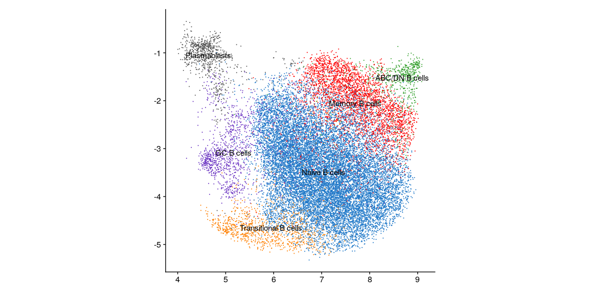
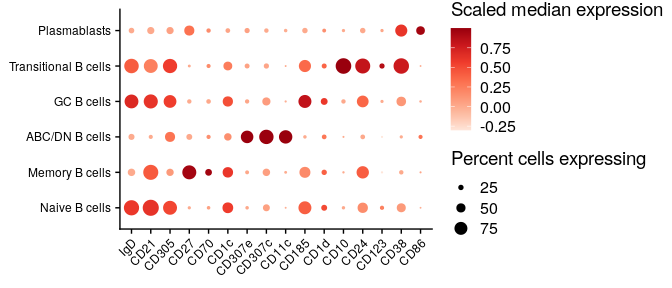

Figure 4
================
Kevin Thomas
15 November, 2021

## 4A

``` r
DimPlot(
  object = sc,
  cells = WhichCells(object = sc, expression = `coarse_cell_type` %in% c("B cells", "Plasmablasts") & `wnnUMAP_1` > 4 & `wnnUMAP_2` < 0),
  reduction = "umap_wnn",
  dims = c(1,2),
  group.by = "clusters_annotated",
  cols = `names<-`(pals::cols25(n = length(levels(sc$clusters_annotated))), levels(sc$clusters_annotated)),
  label = TRUE,
  label.size = 4,
  repel = FALSE
) +
  theme(legend.position = "none") +
  labs(title = NULL, x = NULL, y = NULL) +
  coord_fixed()
```

<!-- -->

## 4B

``` r
# Generate CITEseq markers for B cells
b_markers_cite <-
  ## Look only at B cells and Plasmablasts
  subset(sc, `coarse_cell_type` %in% c("B cells", "Plasmablasts")) %>%
  ## Define CITEseq markers of each annotated cluster by fast wilcoxon test
  wilcoxauc(
    X = .,
    seurat_assay = "CITE",
    group_by = "clusters_annotated"
  ) %>%
  as_tibble() %>%
  dplyr::select(feature,
                cluster = group,
                p_val = pval,
                p_val_adj = padj,
                avg_logFC = logFC,
                pct.1 = pct_in,
                pct.2 = pct_out,
                auc
  ) %>%
  ## Significance filter
  filter(p_val_adj <= 0.1) %>%
  mutate(cluster = factor(cluster, levels = unique(cluster)[c(4, 3, 1, 2, 6, 5)])) %>%
  group_by(cluster) %>%
  ## Positive markers only, remove the isotype control
  filter(avg_logFC > 0, feature != "isotype-control") %>%
  ## Rank markers in each cluster by average logFC
  arrange(-avg_logFC, by.group = TRUE) %>%
  ## If two clusters share a marker, the cluster with a higher average logFC is prioritized
  filter(
    avg_logFC == map_dbl(split(., .$feature), ~max(.x$avg_logFC))[feature]
  ) %>%
  ## Top 3 features for each cluster
  slice_head(n = 3) %>%
  .$feature
# Bubbleplot
bubbleplot(
  object = subset(sc, `coarse_cell_type` %in% c("B cells", "Plasmablasts")),
  assay = "CITE",
  slot = "data",
  features_plot = b_markers_cite,
  preserve_feature_order = TRUE,
  grouping_var = "clusters_annotated",
  filter_exp_pct_thresh = 1,
  avg_func = "median",
  do_return = TRUE
) +
  scale_color_distiller(palette = "Reds", direction = 1) +
  labs(title = NULL, x = NULL, y = NULL, col = "Scaled median expression", size = "Percent cells expressing") +
  theme(axis.text.x = element_text(angle = 45, hjust = 1, vjust = 1))
```

    ## Scale for 'colour' is already present. Adding another scale for 'colour', which will replace the existing scale.

<!-- -->

## 4C

``` r
# Generate gene markers for B cells
b_markers_genes <-
  subset(sc, `coarse_cell_type` %in% c("B cells", "Plasmablasts")) %>%
  wilcoxauc(
    X = .,
    seurat_assay = "SCT",
    group_by = "clusters_annotated"
  ) %>%
  as_tibble() %>%
  dplyr::select(feature,
                cluster = group,
                p_val = pval,
                p_val_adj = padj,
                avg_logFC = logFC,
                pct.1 = pct_in,
                pct.2 = pct_out,
                auc
  ) %>%
  filter(p_val_adj <= 0.1) %>%
  mutate(cluster = factor(cluster, levels = unique(cluster)[c(4, 3, 1, 2, 6, 5)])) %>%
  group_by(cluster) %>% 
  filter(auc > 0.55) %>%
  arrange(-auc, by.group = TRUE) %>%
  filter(
    auc == map_dbl(split(., .$feature), ~max(.x$auc))[feature]
  ) %>%
  slice_head(n = 5) %>%
  .$feature
# Heatmap
scale <- function(x) {
  (x-min(x))/(max(x)-min(x))
}
mat <- FetchData(
  object = subset(sc, `coarse_cell_type` %in% c("B cells", "Plasmablasts")),
  vars = c("clusters_annotated", b_markers_genes)
) %>%
  as_tibble(rownames = "cell") %>%
  group_by(clusters_annotated) %>%
  summarize_if(is.numeric, mean) %>%
  mutate_at(b_markers_genes, scale) %>%
  as.data.frame() %>%
  column_to_rownames("clusters_annotated")
pheatmap(
  mat = t(mat),
  scale = "none",
  breaks = seq.int(from = 0, to = 1, length.out = 100),
  color = colorRampPalette(RColorBrewer::brewer.pal(n = 7, name = "Blues"))(100),
  cluster_rows = FALSE,
  cluster_cols = FALSE,
  angle_col = 90,
  legend = TRUE
)
```

<!-- -->

## 4D-4I

``` r
# Collect percent of B cells in each cluster per patient
vln_data <- sc %>%
  FetchData(
    object = .,
    vars = c("clusters_annotated", "subject_id", "ancestry", "classification"),
    cells = WhichCells(sc, expression = `coarse_cell_type` %in% c("B cells", "Plasmablasts"))
  ) %>%
  group_by(ancestry, classification, subject_id, clusters_annotated) %>%
  summarize(total_cells = n()) %>%
  mutate(
    percent_total = 100*total_cells/sum(total_cells),
    group = paste(ancestry, classification)
  )
```

    ## `summarise()` has grouped output by 'ancestry', 'classification', 'subject_id'. You can override using the `.groups` argument.

``` r
# Re-order factor levels
vln_data$group <- factor(
  x = vln_data$group,
  levels = c(
    "EA Control",
    "EA SLE INACT",
    "EA SLE ACT",
    "AA Control",
    "AA SLE INACT",
    "AA SLE ACT"
  )
)
# Violin plots for each cluster
vln_data %>%
  ggplot(aes(x = group, y = percent_total)) +
  geom_violin(aes(fill = clusters_annotated), scale = "width") +
  scale_fill_manual(
    values = `names<-`(
      x = pals::cols25(n = length(levels(vln_data$clusters_annotated))),
      values = levels(vln_data$clusters_annotated)
    )
  ) +
  geom_boxplot(width = 0.2, outlier.shape = NA) +
  geom_jitter(width = 0.2, size = 0.4) +
  ## Show statistics for Wilcoxon comparisons
  ggpubr::stat_compare_means(
    aes(label = ..p.format..),
    method = "wilcox.test",
    method.args = list(
      formula = percent_total ~ group,
      p.adjust.method = "BH"
    ),
    comparisons = list(
      c("EA Control", "AA Control"),
      c("EA Control", "EA SLE INACT"),
      c("EA SLE INACT", "EA SLE ACT"),
      c("EA Control", "EA SLE ACT"),
      c("AA Control", "AA SLE INACT"),
      c("AA SLE INACT", "AA SLE ACT"),
      c("AA Control", "AA SLE ACT")
    ),
    hide.ns = TRUE,
    show.legend = TRUE,
    symnum.args = list(cutpoints = c(0, 0.0001, 0.001, 0.01, 0.05, Inf), symbols = c("****", "***", "**", "*", "ns"))
  ) +
  xlab(NULL) +
  ylab(NULL) +
  facet_wrap(~clusters_annotated, scales = "free", ncol = 3) +
  cowplot::theme_cowplot() +
  theme(
    strip.background = element_blank(),
    strip.text = element_text(face = "bold"),
    legend.position = "none",
    axis.text.x = element_text(angle = 45, hjust = 1, vjust = 1)
  )
```

<!-- -->

## 4L-4N + S18

``` r
# Gather normalized expression data for heavy chain genes
ig_data <- sc %>%
  FetchData(
    object = .,
    vars = c("clusters_annotated", "ancestry", "classification", "subject_id", grep(pattern = "^IGH", x = rownames(sc), value = TRUE)),
    cells = WhichCells(sc, expression = `coarse_cell_type` %in% c("B cells", "Plasmablasts"))
  ) %>%
  select(
    clusters_annotated,
    ancestry,
    classification,
    subject_id,
    IGHD,
    IGHM,
    IGHA1,
    IGHA2,
    IGHG1,
    IGHG2,
    IGHG3,
    IGHG4,
    IGHE
  )
# Determine the heavy chain gene with the highest expression in each cell
ig_data$max_ig <- colnames(x = ig_data[,grep(pattern = "^IGH", colnames(x = ig_data))])[max.col(m = ig_data[,grep("^IGH", colnames(ig_data))], ties.method = "first")]
# Summarize by disease group and plot results
ig_data %>%
  group_by(ancestry, classification, clusters_annotated, max_ig) %>%
  ## Tally total number of B cells in each study group predominantly expressing each Ig heavy chain
  tally() %>%
  mutate(
    ## Calculate percent of totals
    percent = 100*n/sum(n),
    ## Map the Ig class to each heavy chain gene
    ig_class = map_chr(
      max_ig,
      ~switch(
        .x,
        "IGHA1" = "IgA",
        "IGHA2" = "IgA",
        "IGHD" = "IgM",
        "IGHE" = "IgE",
        "IGHG1" = "IgG",
        "IGHG2" = "IgG",
        "IGHG3" = "IgG",
        "IGHG4" = "IgG",
        "IGHM" = "IgM"
      )
    ),
    ig_class = factor(ig_class, levels = c("IgA", "IgE", "IgG", "IgM")),
    ## Order the study groups
    group = factor(
      paste(ancestry, classification),
      levels = c(
        "EA Control",
        "EA SLE INACT",
        "EA SLE ACT",
        "AA Control",
        "AA SLE INACT",
        "AA SLE ACT"
      )
    )
  ) %>%
  ## Barplot
  ggplot(aes(x = group, y = percent, fill = ig_class)) +
  geom_bar(stat = 'identity') +
  labs(x = NULL, y = "Percent of B cells", fill = NULL) +
  facet_wrap(~clusters_annotated, scales = "free") +
  cowplot::theme_cowplot() +
  theme(
    strip.background = element_blank(),
    strip.text = element_text(face = "bold"),
    axis.text.x = element_text(angle = 45, hjust = 1, vjust = 1)
  )
```

<!-- -->
